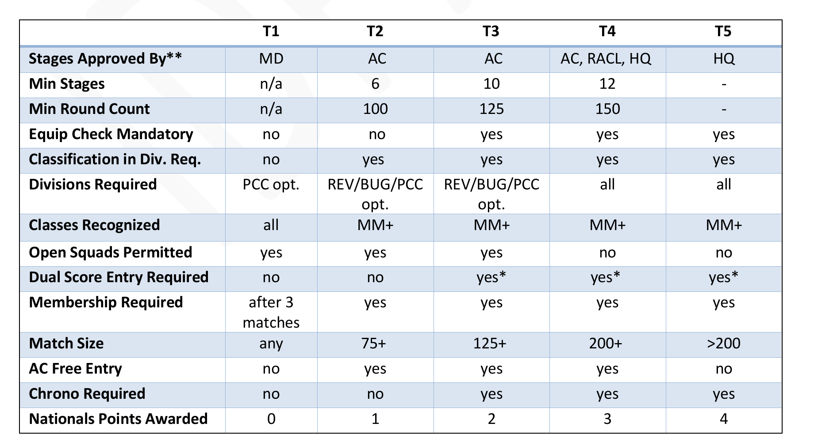
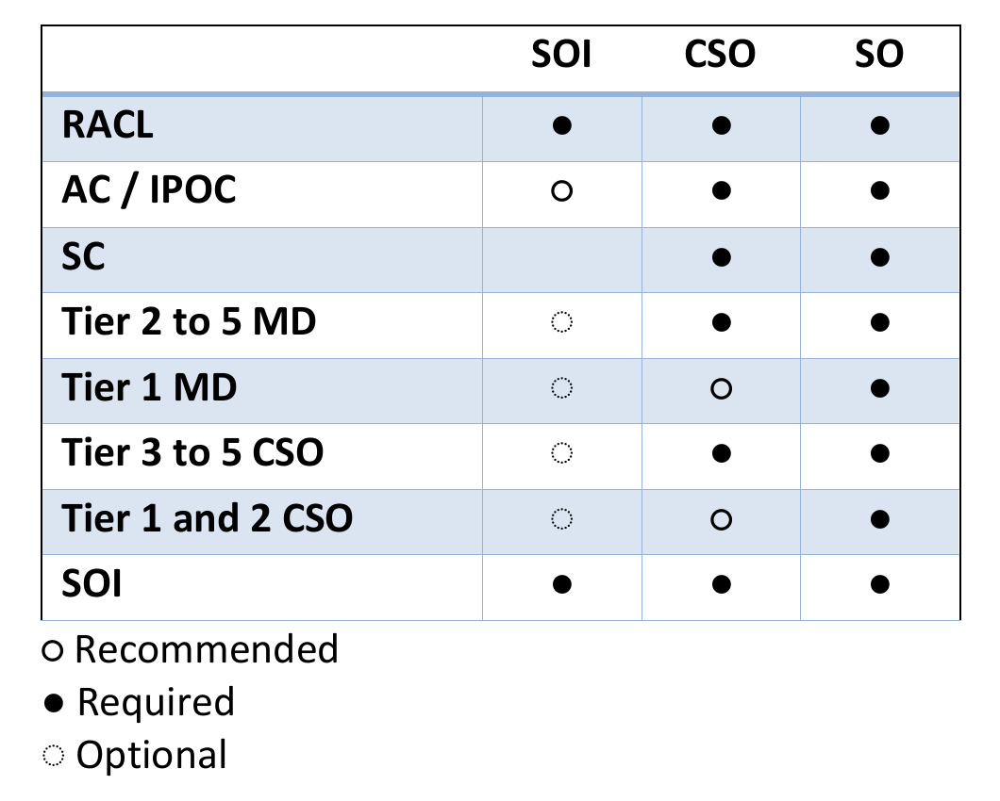

# 2025 IDPA Match Administration Rules

Ver. 2025

150 CR 4603 Bogata, Texas 75417 Phone: 870-545-3886 www.idpa.com

MATCH ADMINISTRATION RULES OF THE INTERNATIONAL DEFENSIVE PISTOL ASSOCIATION, INC. Adopted 10/26/96, amended 2/1/2025 © 1996 -2023 International Defensive Pistol Association, Inc. All rights reserved. ver 2025

The following rule book supplement pertains to the administration of IDPA matches. It is intended for Safety Officers, Match Directors, IPOCs, State & Area Coordinators* as well as those member's wishing to volunteer for these positions. *(note: All instances referring to AC's or Area Coordinators are the same as IPOC's or International Points of Contact outside of the U.S. for the purposes of this rulebook)

## Contents

M-1. CLUBS
M-2. MATCH RULES
M-3. MATCH TIERS
M-4. AWARDS
M-5. SUBCATEGORIES
M-6. PRIZES
M-7. FIREARM TEST BOXES
M-8. MATCH EQUIPMENT CHECK GUIDELINES
M-9. WRITTEN STAGE BRIEFINGS
M-10. STAGE RELIABILITY
M-11. MATCH DQS
M-12. IDPA MATCH OFFICIALS
M-13. MD ROLES & RESPONSIBILITIES
M-14. SO ROLES & RESPONSIBILITIES
M-15. CHIEF SAFETY OFFICER
M-16. SAFETY OFFICER CODE OF CONDUCT
M-17. SAFETY OFFICER INSTRUCTOR ROLES & RESPONSIBILITIES
M-18. CLASSIFICATION RULES

# M-1 CLUBS

M-1.1 An IDPA affiliated club is a group of shooters who come together to put on IDPA matches. The first impression a new shooter gets of an affiliated club is the first impression that person gets of IDPA. IDPA matches and facilities must be open to all IDPA members.

M-1.2 IDPA is unique in that it offers clubs an exciting, competitive format for shooters using truly practical firearms carried in a truly practical way. Financial costs for IDPA clubs are minimal. There are no fees other than the annual affiliation fee. The rules of IDPA are minimal, thereby placing a lesser burden on club officers. The IDPA classification system allows competitors to classify in one day. There are many good CoF design templates available on a number of websites. These can be modified to provide more variety.

M-1.3 IDPA is a Trophy-only Club based sport. Due to the trophy-only status of IDPA, a large burden has been taken off the match organizers since they do not have to worry about soliciting cash and merchandise prizes for their events.

M-1.4 IDPA headquarters will refer all interested parties in your area to your club. Your club information should be posted on the IDPA website at www.idpa.com by the Match Director or Club Contact. This information should include local matches and classifiers.

M-1.5 Some countries have laws that prohibit concealed carry and self-defense; therefore, those interested in shooting or organizing IDPA competitions in these countries face unique problems. Due to this unfortunate political situation, IDPA authorizes the clubs in these countries to modify the name of the organization, logo and/or rules to meet local legal requirements. However, no Championship Matches will be "sanctioned" in any country where the competition cannot be run 100% under IDPA rules.

M-1.6 Requirements for Club Affiliation

M-1.6.1 Match director/club contact personnel must be current IDPA members.

M-1.6.2 Match director/club contact personnel must be certified IDPA Safety Officers.

M-1.6.3 Club matches must be open to all IDPA members.

M-1.6.4 It is recommended that clubs run a Standard IDPA Classifier Match as one of their monthly matches, or as part of a monthly match. It is also recommended that an Abbreviated Classifier be included in a monthly match as a stage or as a stand-alone optional stage. It is permissible to allow reshoots of a whole stage due to equipment problems and/or shooter mental errors for the purpose of accurate Classification as long as the reshoot occurs on the same day as the rest of the Classifier. However, no reshoots of individual strings of fire are permitted. If the Classifier is part of a scored match with other IDPA stages no reshoots are permitted.

M-1.6.5 Clubs must hold a minimum of six (6) IDPA matches per year.

M-1.6.6 At club level events, competitors may shoot in any of the regular divisions.

M-1.6.7 Clubs must follow all IDPA rules and principles for every match. Clubs having special conditions or safety rules for equipment or props must obtain a special written exemption from standard IDPA practices and publish these rules publicly in match and club announcements before an IDPA event. The Area Coordinators* facilitate these exemptions with Headquarters.

M-1.6.8 Loss of affiliation can occur in cases where the requirements are not met.

M-1.7 Clubs must make sure the competitors have the benefit of the doubt when competing. Fun and camaraderie are essential elements of IDPA.

M-1.8 Headquarters (HQ) maintains records of all members, takes care of all Pro Shop orders, handles membership questions, produces the Tactical Journal (the quarterly publication for members), etc. All decisions that come from HQ are based on what is best for the individual member, the club and the sport.

M-1.9 Logo Policy: The International Defensive Pistol Association logo is trademarked private property of the International Defensive Pistol Association, Inc. It is not available for individual commercial use. However, currently affiliated clubs may use the logo on match announcements, correspondence or on event commemorative clothing such as hats and tee shirts. Electronic versions are available from IDPA.com.

M-1.10 Insurance Information: IDPA does not offer liability insurance. We recommend that you contact the NRA for possible information.

# M-2 MATCH RULES

M-2.1 All IDPA rules must be followed for every match at every tier. All shooters are bound by the Shooters Code of Conduct at every tier event.

M-2.2 Safe areas, as defined in section 2.10, are required at all matches.

M-2.3 Other than tier one (1), official IDPA score sheets printed on NCR paper in duplicate will be used in the match if paper score sheets are used to enter scores. If scoring is done electronically, the shooter is responsible to verify the accuracy of their score while they are on the stage.

M-2.4 For sanctioned matches, the event information is created on a club's online profile and the non-refundable sanctioning fee for Tier Two and higher matches must be remitted to IDPA headquarters. The match, including the stages, must be approved by the Area Coordinator/stage approval team at least ninety (90) days before match date. This includes the AC design aid form before the match is finalized as a sanctioned event with IDPA. If the stages and design form are not completed by the deadline, the sanctioning of the match will be lowered a tier or removed, and the event will be removed from the IDPA calendar of events. The sanctioning process and pricing information is obtained from the responsible AC/IPOC.

M-2.4.1 All sanctioned matches conducted outside the US must have stages reviewed by the IPOC and approved by IDPA HQ no later than 90 days prior to the match. The reviewing IPOC should complete the Sanctioned Match Approval Aid Spreadsheet.

M-2.5 Every stage at matches sanctioned by IDPA shall include a written stage description for the stage that is both legal and approved by the responsible Area Coordinator*.

M-2.6 A well written stage description contributes to the success of a match and prevents confusion and frustration among staff and competitors. In it, the stage procedure includes instructions and restrictions that are placed upon the shooter to complete that CoF. Refer to M-9.1 for requirements.

M-2.7 All "named" matches (including the words state, regional, or national etc. that hand out awards at the end of the match) other than a club's local matches must be Sanctioned Matches.

M-2.7.1 How to Create a Match Event and Reserve a Match Date

M-2.7.1.1 The MD logs into their IDPA account

M-2.7.1.2 The MD creates the match by hovering their mouse over the "Matches" tab and clicking "create match"

M-2.7.1.3 The MD then creates the match including Tier, date, location etc. At this point the match is not visible to the public.

M-2.7.1.4 Once the match is submitted, the MD will alert the AC that they have created a pending match.

M-2.7.1.5 The AC will log into their IDPA account and mark the match 'Pending Approval".

M-2.7.1.6 Once the AC marks the match as Pending Approval, an invoice is emailed out to the MD.

M-2.7.1.7 The MD pays the match fees which then makes the match visible to everyone on the IDPA website with the match labeled as "Pending Final Approval".

M-2.7.1.8 Within 90 days of the match, the MD calls the AC to finalize match plans.

M-2.7.1.9 The MD submits Stages for approval to the AC or IPOC. This may take time, so begin a few weeks before the 90 day requirement.

M-2.7.1.10 IDPA approves the stages. T2 & T3 stages and the match are approved by the AC/IPOC who forwards a copy to the RACL. T4 stages are approved by the AC, RACL and the HQ stage approval team.

M-2.7.1.11 All matches outside of the United States, T2 – T4, must have stages reviewed by their IPOC and IDPA HQ via the Stage Approval Team.

M-2.7.1.12 Once all match details are finalized and approved the AC/IPOC will mark the match as "Approved".

M-2.7.1.13 Matches that do not have their stages approved within the required timeframe will have the sanctioning of the match removed and the match will be removed from the IDPA website.

M-2.8 The Match Director must be an active IDPA certified Safety Officer.

M-2.8.1 If an Area Coordinator is also the Match Director, then the stages must be approved by another Area Coordinator or IDPA Headquarters.

M-2.9 Scoring methods

Electronic scoring systems have become popular and widely used for matches at every level. Electronic scoring systems are available that allow the competitor and scorekeeper to review scores before they are posted to the system. It is the shooters responsibility to ensure the correctness of scores as they are posted by accepting or initialing the tablets.

M-2.9.1 For Sanctioned Matches when paper is used, the Scorekeeper must sign or initial the paper score sheet after each shooter's raw time, points down, and penalties are determined and recorded. For Sanctioned Matches, each shooter must sign or initial their paper score sheet. Signing or initialing the paper score sheet gives the shooter the chance to review and understand the score. Local matches can require signatures, initials, or acknowledgement of electronic scores at their discretion.

M-2.9.2 Whether the shooter signs or initials the score sheet, or acknowledges the electronic score, or not does not freeze the score. The score may be edited and updated by the match director up to the time when official scores are posted, and the protest period begins.

M-2.9.3 After the score sheet leaves the control of the original Scorekeeper, only the Match Director can make changes. Other SOs or other staff cannot change the score sheet or the score. If that needs to be done, the Match Director will be called to determine if changes are appropriate and make those changes. A reasonable attempt to notify the shooter of the changes will be made and documented.

M-2.9.4 Scores must be made available for competitors to review periodically during sanctioned matches. This can be accomplished using direct email, publishing on a web site or by printed hard copies posted in a central location.

M-2.9.5 Protest Period

M-2.9.5.1 A protest period may not extend beyond one hour after final scores have been posted. Match Director's may poll competitors that are present after a match for agreement on finalizing the posted scores.

M-2.9.5.2 If no one present disagrees, the one-hour protest period may be waived.

M-2.9.5.3 In cases where competitors have left the property and are not present, they have up to and until the final time to contact the MD or his or her designate to report discrepancies in their scores.

M-2.9.5.4 Once the MD declares the scores final, they may not be changed.

M-2.9.5.5 Any discrepancies that are brought to the attention of the MD or AC after the scores are final must be detailed in the match AAR.

M-2.10 Scores are final and cannot change after the protest period at the end of a match.

M-2.11 Video or photography may not be used to determine a shooter's score.

M-2.12 Ties shall be broken in a manner decided upon by the match director conducting the contest; however, this shall always be done by shooting, not by chance. All tied shooters will qualify for a match class promotion (bump) if applicable.

M-2.13 All competitors at a Tier Two or higher match must be able to view the match stages before their scheduled shooting session. Shooters will not be allowed within the stage boundary as denoted by the Match Director using "caution tape," fencing or another suitable visual indicator.

M-2.14 When a match is advertised at a tier level above Tier 2, the number of competitors must match the minimum match requirements. Otherwise, HQ will approve following year matches at the level commensurate to the number of attendees in the previous year. For example, if a match was advertised as a Tier 4 match and had only 90 shooters, the next year's match will be approved as a Tier 2 match.

M-2.15 Tier Four matches are typically larger regional, or state matches held on an annual basis and will only be approved if the requesting club has a prior history of running sanctioned matches with the historical numbers to demonstrate that attendance. This is determined and approved by the responsible AC or IPOC.

M-2.16 HQ reviews match After Action Reports for the purpose of maintaining the rule standards for each sanctioned match and reserves the right to make corrections in future events based on the reviewed findings.

# M-3 MATCH TIERS

Matches will be categorized by tiers, where a local club match is Tier One and a national level match being Tier Five.

M-3.1 Tier One Matches (Local club match)

M-3.1.1 Stages are approved by the Match Director.

M-3.1.2 Equipment checks are recommended.

M-3.1.3 Competitors must be IDPA members after their 3rd match.

M-3.1.4 Competitors having a current classification in the division in which they are competing is recommended.

M-3.1.5 Recognizing all pistol divisions is required. PCC is Optional.

M-3.1.6 All classes must be recognized.

M-3.1.7 Any special range safety rules should be posted at registration. (i.e., no high muzzles during reloads, etc.)

M-3.1.8 Open squads (shotgun starts) are permitted.

M-3.2 Tier Two Matches

M-3.2.1 Must be able to accommodate at least 75 competitors, including staff. (There may be circumstances where international matches are exempt from this requirement.)

M-3.2.2 Minimum number of stages is 6.

M-3.2.3 Minimum round count is 100.

M-3.2.4 At least one standards stage is recommended.

M-3.2.5 Standards stage round count must not exceed 20% of the total round count.

M-3.2.6 A Chief Safety Officer per two stages or per bay is required. A Chief Safety Officer is appointed by the Match Director as the Safety Officer running a stage (or bay). The CSO must be a certified Safety Officer

M-3.2.7 A minimum of one (1) IDPA Certified Safety Officer per bay is required.

M-3.2.8 Stages are approved by the Area Coordinator.

M-3.2.9 Dual score entry is recommended for paper score sheets. Electronic scoring tablets may be used in lieu of paper scoresheets.

M-3.2.10 Legible shooting session scores must be posted within one hour of the session end.

M-3.2.11 If shooters will not be present when the final scores are posted, the scores for each session must be posted to allow shooters to check their scores.

M-3.2.12 Chronograph testing of competitor ammunition is recommended.

M-3.2.13 Equipment checks are recommended.

M-3.2.14 Competitors must be IDPA members in good standing by the last day of competition.

M-3.2.15 Competitors must have a classification in the division in which they are competing by the day of competition. This can be derived using equity or classifier score.

M-3.2.16 Classification promotions must be entered into the on-line Classification database at IDPA headquarters within one week of the match completion.

M-3.2.17 Recognition of one regular divisions is required.

M-3.2.18 Recognizing novice class is recommended, while Marksman and above is required.

M-3.2.19 The Area Coordinator or their designate must be offered entry to the match at no charge.

M-3.2.20 Any special range safety rules must be posted on the web site registration page or printed on the registration form. (e.g., no high muzzles during reloads, etc.)

M-3.2.21 Open squads (shotgun squads) are permitted.

M-3.2.22 All competitors in the match will earn one (1) National's match point.

M-3.3 Tier Three Matches

M-3.3.1 Must be able to accommodate at least 125 competitors, including staff. There may be circumstances where international matches are exempt from this requirement.

M-3.3.2 Minimum number of stages is 10.

M-3.3.3 Minimum round count is 125.

M-3.3.4 At least one standards stage is required.

M-3.3.5 Standards stage round count must not exceed 20% of the total round count.

M-3.3.6 A Chief Safety Officer per two stages or per bay is required.

M-3.3.7 A Chief Safety Officer is appointed by the Match Director as the Safety Officer running a stage (or bay). The CSO must be an IDPA certified Chief Safety Officer.

M-3.3.8 At least two IDPA Certified Safety Officers per bay are required.

M-3.3.9 Stages are approved by the Area Coordinator.

M-3.3.10 Dual score entry is recommended for paper score sheets. Electronic scoring tablets may be used in lieu of paper scoresheets.

M-3.3.11 Legible shooting session scores must be posted within one hour of the session end.

M-3.3.12 If shooters will not be present when the final scores are posted, the scores for each session must be posted to allow shooters to check their scores.

M-3.3.13 Chronograph testing of competitor ammunition is required.

M-3.3.14 Equipment checks are required. Equipment checks include ensuring the gun is within weight limits and fits in the IDPA gun test box as specified in the Equipment Rules section. Proper placement and design of ammunition carriers and holsters must also be checked.

M-3.3.15 Competitors must be IDPA members in good standing on the last day of competition.

M-3.3.16 Competitors must have a classification in the division in which they are competing on the day of competition. This can be derived using equity or classifier score.

M-3.3.17 Classification promotions must be entered into the on-line Classification database at IDPA headquarters within one week of the match completion.

M-3.3.18 Recognizing at least, 3 regular divisions is required unless advertised differently and approved by the AC/IPOC. REV, BUG & PCC are optional.

M-3.3.19 Recognizing all classes other than Novice is required.

M-3.3.20 The Area Coordinator or their designate must be offered entry to the match at no charge.

M-3.3.21 Any special range safety rules must be posted on the web site registration page or printed on the registration form. (I.e., no high muzzles during reloads, etc.)

M-3.3.22 Squadded shooters are recommended at this level. Open Squads must be noted in the registration information.

M-3.3.23 All competitors in the match will earn two Nationals match points.

M-3.4 Tier Four Matches

M-3.4.1 Must be able to accommodate at least 200 competitors, including staff. There may be circumstances where international matches are exempt from this requirement.

M-3.4.2 Minimum number of stages is 12.

M-3.4.3 Minimum round count is 150.

M-3.4.4 At least one standard stage is required.

M-3.4.5 Standards stage round count must not exceed 20% of the total round count.

M-3.4.6 A Chief Safety Officer per two stages or per bay is required.

M-3.4.7 A Chief Safety Officer is appointed by the Match Director as the Safety Officer running a stage (or bay). The CSO must be a certified Safety Officer.

M-3.4.8 At least two IDPA Certified Safety Officers per bay are required.

M-3.4.9 Stages are approved by the Area Coordinators and IDPA HQ Stage approval team.

M-3.4.10 Dual score entry is required for paper score sheets. Electronic scoring tablets may be used in lieu of paper scoresheets.

M-3.4.11 Legible shooting session scores must be posted within one hour of the session end. If shooters will not be present when the final scores are posted, the scores for each session must be posted to allow shooters to check their scores.

M-3.4.12 Chronograph testing of competitor ammunition is required.

M-3.4.13 Equipment checks are required. Equipment checks include ensuring the gun is within weight limits and fits in the IDPA gun test box as specified in the Equipment Rules section. Proper placement and design of ammunition carriers and holsters must also be checked.

M-3.4.14 Competitors must be IDPA members in good standing by the last day of competition.

M-3.4.15 Competitors must have a classification in the division in which they are competing by the day of competition.

M-3.4.16 Classification promotions must be entered into the on-line Classification database at IDPA headquarters within one week of the match completion.

M-3.4.17 Recognizing all divisions is required unless advertised differently and approved by the AC/IPOC and both RACLs.

M-3.4.18 Recognizing all classes above Novice is required. (Novice class is optional)

M-3.4.19 The Area Coordinator or designate must be offered entry to the match at no charge.

M-3.4.20 Any special range safety rules must be posted on the web site registration page or printed on the registration form. (I.e. no high muzzles during reloads, etc.).

M-3.4.21 Open squads (shotgun squads) are not permitted.

M-3.4.22 All competitors in the match will earn three Nationals match points.

M-3.5 Tier Five Matches

M-3.5.1 HQ sponsored matches include the US National Championship, any World Championships or any other HQ sponsored championship. These names are held for exclusive use and licensing of IDPA.

M-3.5.2 At least one standards stage is required.

M-3.5.3 Standards stage round count must not exceed 20% of the total round count.

M-3.5.4 A Chief Safety Officer per two stages or per bay is required. A Chief Safety Officer is appointed by the Match Director as the Safety Officer running a stage (or bay). The CSO must be an IDPA certified Chief Safety Officer.

M-3.5.5 At least two (2) IDPA Certified Safety Officers per bay are required.

M-3.5.6 Stages are approved by IDPA headquarters.

M-3.5.7 Electronic scoring tablets are used in lieu of paper scoresheets.

M-3.5.8 Legible shooting session scores must be posted within one hour of the session end. If shooters will not be present when the final scores are posted, the scores for each session must be posted to allow shooters to check their scores.

M-3.5.9 Chronograph testing of competitor ammunition is required.

M-3.5.10 Equipment checks are required. Equipment checks include ensuring the gun is within weight limits and fits in the IDPA gun test box as specified in the Equipment Rules section. Proper placement and design of ammunition carriers and holsters must also be checked.

M-3.5.11 Competitors must be IDPA members in good standing by the day of competition.

M-3.5.12 Competitors must have a current (12 month or less) classification in the division in which they are competing by the day of competition.

M-3.5.13 Classification promotions must be entered into the on-line Classification database at IDPA headquarters within one week of the match completion.

M-3.5.14 Recognizing all divisions is required unless a waiver is applied by IDPA HQ (utilizing input from the RACLs for matches inside the USA or the IPOC lead for matches outside of the USA.)

M-3.5.15 Recognizing all classes above Novice is required.

M-3.5.16 Any special range safety rules must be posted on the web site registration page or printed on the registration form. (i.e. no high muzzles during reloads.)

M-3.5.17 Open squads (shotgun squads) are not permitted.

M-3.5.18 All competitors in the match will earn four (4) National's match points.

M-3.5.19 The Match Director(s) will earn a free slot to the following year's Nationals.

M-3.5.20 The Match Director(s) must not shoot the match for score.

M-3.6 Tiered Match Summary Table

*Where paper scoring is used. **All international sanctioned matches must have their stages approved by the Stage Approval Team

M-3.7 Specialty Matches

Specialty Sanctioned matches, such as Revolver only, BUG only, women only, a single manufacturer, or standards only match, etc., must be approved by IDPA headquarters. All competitors in a Specialty match will earn National's match points commensurate to the approved Tier.

M-3.8 Postal Matches

M-3.8.1 IDPA Postal Matches must be approved by headquarters and published on the IDPA website no later than 30 days before the start of the match.

M-3.8.2 These are Tier 1 events with optional national match points if this is announced when the match appears on the IDPA website.

M-3.8.3 Postal Match participation may only be run by affiliated clubs in good standing that are held as a club event.

M-3.8.4 Stages must be administered and run by IDPA certified Safety Officers OR CSOs.

M-3.8.5 Stage descriptions must include a complete list of props and dimensions (including height to the top of the heads) when the match is published.

M-3.8.6 Matches are open to approved IDPA Match divisions only. Not for Competition (NFC) and Specialty Divisions are not counted as a division for Postal Matches.

M-3.8.7 Competitors may only shoot one entry per division entered. The number of divisions a person may enter must be published online when the match is announced.

M-3.8.8 Competitors must have a current membership and a classification in the division in which they are competing on the last day of competition in order for the score to appear in the final scores.

M-3.8.9 Postal Matches are not classifiers.

M-3.8.10 Competitors will not receive a promotion to a higher classification as the result of their placement in the final scores. i.e. no match bumps.

M-3.8.11 The Match Director is responsible for collating and publishing match scores at the conclusion of the match.

M-3.8.12 Awards for the match and the manor of distribution must be included in the original match description when approved and published online.

# M-4 AWARDS

M-4.1 At Tier Two and higher matches, awards and match bumps will be given based on number of contestants per class and division (including DQs and DNFs, but not including no-shows) and go to the top one-fifth of those competitors. Tier two and higher matches will provide a minimum of one award for each 5 entrants, rounding up. One award for 1-5 entrants, two awards for 6-10 entrants, etc.

M-4.2 Tier two and higher matches must give trophies or plaques for the Division Champions. The remaining awards may be trophies, medals or medallions, etc.

M-4.2.1 Example: 1-5 shooters in ESP/MM = 1st award.

M-4.2.2 6-10 shooters in ESP/MM = 1st and 2nd awards.

M-4.2.3 11-15 shooters in ESP/MM = 1st, 2nd and 3rd awards.

M-4.2.4 16-20 shooters in ESP/MM = 1st, 2nd, 3rd and 4th awards, etc.

M-4.3 For Tier Two and higher matches the MD may choose to give more trophies and/or awards by awarding the top one-fourth or top one-third of shooters; however, every division must use the same ratio.

M-4.4 The Division Champion is the shooter with the best score in each division, regardless of their classification. The Division Champion in a division is also the first-place finisher in the DC's classification.

M-4.5 Distinguished Masters are only eligible to win their Division Champion award and any subcategory award that may be applicable like High Senior, High Law Enforcement, etc. All DM scores must be included in the match results with all the other shooters' scores. Each division shall stand alone and there will be no 'high overall' trophy awarded.

# M-5 SUBCATEGORIES

M-5.1 Subcategories may be recognized at tier one (1) matches but are required at Tier Two and higher matches for iron sight divisions if there are at least 3 competitors in the category. It is recommended that PCC and/or CO subcategories be broken out separately, at the discretion of the MD.

M-5.2 SO-Staff include all of the certified staff members participating in the administration, officiation and execution of the match.

M-5.3 On the day of the match, your age determines the category:

M-5.3.1 Junior Member - 12th birthday through 17 years of age

M-5.3.2 Typical Member -18th birthday through 49 years of age

M-5.3.3 Senior Member - 50th birthday through 64 years of age

M-5.3.4 Distinguished Senior Member - 65th birthday and older

M-5.4 Competitors may choose one of the following to add to their registration if they apply at the time of the match:

M-5.4.1 High Lady - Gender at birth

M-5.4.2 High Junior - ages 12 to 17

M-5.4.3 High Senior - ages 50 to 64

M-5.4.4 High Distinguished Senior - ages 65 and older

M-5.4.5 High Industry - a competitor currently employed in the firearms or firearms accessory industry (must receive a W-2 or 1099 form or equivalent).

M-5.4.6 High International – a competitor currently living full time in a country other than the country in which the match is held.

M-5.4.7 High Military - a competitor currently serving in the Armed Forces of his/her country of residence.

M-5.4.8 High Law Enforcement – a competitor who is currently a paid full or part time law enforcement officer with statutory arrest authority.

M-5.5 High Staff – an additional special category that is added to each competitor, who is certified staff, participating in the administration, officiation and execution of the match.

M-5.6 A "Most Accurate" award is given to the competitor with the lowest points down and no HNT penalties.

M-5.7 18–21-year-old shooters may shoot a match without a parent or guardian present, if allowable based on range policies, federal, state, and local law.

M-5.8 Junior members must have a parent or guardian present with the shooter at every stage.

M-5.9 The Match Director may require proof of eligibility for subcategory entries.

M-5.10 Clubs are encouraged to develop other relevant subcategories.

# M-6 PRIZES

Any merchandise donated or purchased for use as prizes will be distributed randomly. Prizes must not be given away based on the match results or in any manner that is based, even in part, on the competitor's score. Side matches are exempt from this rule. IDPA DOES NOT ENDORSE NOR APPROVE any type of incentive program based on shooter performance beyond classification.

# M-7 FIREARM TEST BOXES

M-7.1 The IDPA firearm test box measurements have dimensional tolerances of -0" to +1/16". Boxes outside this tolerance range may not be used in IDPA matches for equipment checks.

M-7.1.1 Example of tolerance: The width of an SSP, ESP, CCP and CDP gun test box is nominally 8 3/4" long but can range from 8 3/4" to 8 13/16" in width.

M-7.1.2 The firearm must be fully assembled, the longest magazine inserted and slide fully forward in battery (or cylinder closed) and must fully fit into the box with the lid shut. An adjustable rear sight or magazine may be compressed to fit into the box, and the lid may be held shut with light pressure, but not enough force to flex a part on the firearm, flex the box or the lid, or indent the box or lid material.

M-7.1.3 Alternately, equipment inspections using four-sided test boxes that are frames must be placed on a hard flat surface and swept across the top using a straight edge. During this inspection, contact with the firearm is permissible provided the straight edge does not come off the box walls while moving across the firearm. If the straight edge raises off of either side, the firearm does not pass.

M-7.1.4 There is a specialty variant of the box to inspect Carry Optic firearms.

# M-8 MATCH EQUIPMENT CHECK GUIDELINES

M-8.1 Non-IDPA-Legal Modifications

M-8.1.1 When performing equipment checks, the following items should be examined.

M-8.1.1.1 Check for metal magazine gap plugs and brass magazine wells.

M-8.1.1.2 Check the grip material.

M-8.1.1.3 Check proper operation of the thumb safety if present.

M-8.1.1.4 Check for rail and trigger guard mounted lights and lasers in appropriate divisions.

M-8.1.1.5 Check that the SSP, ESP, CCP, CDP, CO and BUG-S firearms, with the largest magazine inserted or BUG-R cylinder closed, fit in the appropriately sized IDPA box.

M-8.1.1.6 Check that the gun and the heaviest magazine do not weigh over the division weight limit. The scale used must be able to weigh a test weight twice with a deviation from true weight of no greater than 0.2 ounces. A calibration weight of 1000 grams or 2 pounds is required for matches T3 – T5. The calibration weight is used to calculate any offset that may be added or subtracted to the firearm test findings to determine if a gun makes weight.

M-8.1.1.7 Check that the gun does not have any modifications excluded from the division.

M-8.2 Clubs should strive to offer a courtesy equipment check prior to the match start or the shooter's first CoF.

M-8.3 Shooters whose equipment fails to meet the standards in the division they are registered for, may, at the discretion of the match director, be moved to another division provided the gun and the competitor meet all the requirements for the new division. If the gun has prohibited modifications, the shooter will be allowed to shoot for no score the discretion of the MD and will receive a DNF providing there were no safety issues with the firearm at the discretion of the match director. If a gun is determined to be unsafe, the gun may not be used the remainder of the match.

M-8.4 Ammunition Power Factor

M-8.4.1 Collect cartridges from each competitor for chronograph. Conduct the official chronograph procedure for each competitor's ammunition.

M-8.4.2 Prior to each shot, the muzzle of the firearm may be elevated to vertical (if range rules permit) to move the powder charge to the rear of the case. If two of the three rounds fired meet or exceed the required power factor, the ammunition complies. If the competitor's ammunition fails to make power factor, the MD has the option to chronograph three additional rounds through the firearm.

M-8.5 Belts, Holsters, Ammunition Carriers and Concealment Garments

M-8.5.1 Check that belts, holsters, ammunition carriers and concealment garments meet the requirements of the equipment section rules using the listed test methods.

M-8.5.2 It is highly recommended that an inspection be done on the first stage of the day before first shots are fired. If competitors have shot stages and are found with illegal gear, they will be disqualified.

M-8.5.3 At the discretion of the match director, they may be allowed to complete the match for no score provided there are no safety issues with the gear (e.g., Unsafe holster).

# M-9 WRITTEN STAGE BRIEFINGS

M-9.1 Every stage will have a written briefing for the stage (sometimes called a Course of Fire, CoF) available at the stage, containing the following sections:

M-9.1.1 Scenario: A brief and meaningful description of the self-defense scenario that the stage portrays.

M-9.1.2 Standards: For standards stages, this section need only to contain the word "Standards." Standard stages are shooting skill tests.

M-9.1.3 Procedure: A brief description of the shooting actions the shooter is supposed to do within the stage for each string of fire. It must include the number of rounds to be fired and any special conditions for example: "strong hand only," "remain seated while shooting", or "while prone".

M-9.1.4 Muzzle Safe Points: Muzzle safe markers or 180-degree rule, or a combination of both.

M-9.1.5 Scoring: Limited or Unlimited.

M-9.1.6 Scored Hits: Number of scored hits per target or per string.

M-9.1.7 Start Position: Describes the start condition of the shooter's firearm and ammunition feeding devices. Also describes the shooter's start position and the action the shooter is performing at the start of the stage, if any.

M-9.1.8 Start Signal: Describes the start signal, like audible, flashing of a light, etc.

M-9.1.9 Stop: Describes the stop signal if any. This is usually the "last shot" but can be other things such as shooting all the targets and then pressing a button, etc.

M-9.1.10 SO notes: Optional instructions to the SO team for safety or proper running of the stage.

M-9.1.11 Stage Diagram: A scale (or rough scale) drawing showing the position of the targets, props including any hard cover or concealment, starting position and points of cover, where appropriate.

M-9.2 A written stage briefing may not supersede the shooting rules in Section 3 with regard to issuing procedural penalties to competitors. While a procedure may suggest a way to complete a string, the instructions are limited to following rulebook Sections 3 & 5 in their guidance with regard to penalizing shooters. After the start signal, penalties for non-shooting actions may not be issued to competitors for their performance on a stage.

# M-10 STAGE RELIABILITY

M-10.1 Stage reliability and consistency is important for every IDPA match. The targets, actuators, props, etc. used within a stage must work correctly and present consistently for all shooters.

M-10.2 For Tier 2 - Tier 5 matches if a stage prop, actuator, or target performs incorrectly more than 10% of the time (10% of scored shooters,) the Chief SO will immediately notify the MD of the reliability issue.

M-10.3 The MD will close the stage and repair the stage. If the stage cannot be made to work reliably within 60 minutes the stage must be removed from the match and match results. This does not include the case where the shooter does not trigger the stage properly, unless the trigger(s) are causing unreliable performance.

# M-11 MATCH DQS

M-11.1 The Match Director must advise the AC, SC, IPOC or Designate (herein referred to as Coordinator) of DQs as they occur.

M-11.2 The coordinator will intervene in a sanctioned match they are responsible for if 3 DQs occur on the same stage, not counting Chrono or Equipment Check stages. The coordinator must immediately investigate the stage for any issues with stage safety, legality, match personnel, construction, or other problematic areas. The issues and investigation findings must be logged in the AAR.

M-11.3 If 5 DQs occur for similar reasons on the same stage, not counting Chrono or Equipment Check stages, the coordinator may remove the stage from the match. The stage removal and reasons must be logged in the AAR.

M-11.4 If a shooter was disqualified from a match and the stage where the DQ occurred is later thrown out, the shooter may not reenter the match.

M-11.5 An AC/IPOC/Designate or MD can remove or reassign an SO from a stage for the following non-inclusive list of events:

M-11.5.1 Using incorrect range commands.

M-11.5.2 Inconsistent walk-through briefings.

M-11.5.3 Inconsistent or incorrect application of the rules.

M-11.5.4 Code of Conduct violations.

M-11.5.5 Safety violations administering a stage.

M-11.6 Reassigning staff during a match will not be grounds for an Appeal for that fact alone.

M-11.7 The MD must be alerted prior to, or immediately after, a match official is re-assigned, suspended or removed as match personnel and the issue must be logged in the AAR.

# M-12 IDPA MATCH OFFICIALS

# M-13 MD ROLES & RESPONSIBILITIES

M-13.1 Match Directors

M-13.1.1 Match Directors are IDPA volunteers whose goal and purpose is to see that all shooters have a safe and enjoyable IDPA match experience by supervising and directing the shooters and match staff through the match.

M-13.2 IDPA Match Director Qualifications

M-13.2.1 Must be an IDPA certified safety officer in good standing with IDPA.

M-13.2.2 MDs for Tier Two (2) matches must be approved by the AC.

M-13.2.3 MDs for Tier Three (3) matches must be current as an IDPA certified CSO and be approved by the AC.

M-13.2.4 MDs for Tier Four (4) and Tier Five (5) matches must be current as an IDPA certified CSO and approved by IDPA HQ.

M-13.2.5 Must be a current IDPA member in good standing and never have had their membership revoked.

M-13.2.6 Must have shot at least six IDPA matches. Newly affiliated IDPA clubs have a six-month grace period for Tier One matches.

M-13.2.7 Must possess the necessary temperament, attitude and IDPA rulebook knowledge to rationally and successfully resolve shooter/SO/CSO disagreements.

M-13.3 Match Director Responsibilities

M-13.3.1 IDPA Ambassador

M-13.3.1.1 Represent IDPA professionally and respectfully on and off the range.

M-13.3.1.2 Respect and support IDPA and other shooting sports, IDPA rules, shooters, and spectators.

M-13.3.1.3 Always be friendly and approachable.

M-13.3.1.4 Go out of your way to welcome new shooters, veteran shooters, and spectators alike.

M-13.3.2 IDPA Match Official

M-13.3.2.1 Adhere to the IDPA Match Director Code of Conduct.

M-13.3.2.2 Confirm to the SC/AC/IPOC or designate that all SOs in a match are certified IDPA Safety Officers in accordance with the requirements governing the match tier.

M-13.3.2.3 Enforce IDPA safe gun handling rules by all shooters.

M-13.3.2.4 Ensure individuals on the range are wearing eye and ear protection, when appropriate.

M-13.3.2.5 Help the shooters to safely complete and enjoy the match.

M-13.3.2.6 Treat the shooters with courtesy and respect.

M-13.3.2.7 Verify that the shooter's equipment is IDPA-legal and correctly worn.

M-13.3.2.8 Avoid interfering with the shooter's execution of the CoF, unless necessary to maintain a safe shooting environment.

M-13.3.2.9 Know and consistently enforce the IDPA rules to ensure that the match is conducted in a fair and impartial manner.

M-13.3.2.10 Be well versed in the IDPA rule book and be able to explain the rules and their application.

M-13.3.2.11 Maintain a fair, impartial manner toward all competitors.

M-13.3.2.12 If there is reasonable doubt, the benefit of the doubt goes to the shooter.

M-13.3.2.13 Ensure all penalties are called correctly and consistently.

M-13.3.2.14 Report all penalties issued for Code of Conduct infractions directly to the Area Coordinator on the day of the match at all sanctioned matches.

M-13.3.2.15 Be available should any additional consultation or appeal be required concerning the behavior of any shooter and any scoring or penalty decisions.

M-13.3.2.16 Ensure that the stages are consistent for all shooters.

M-13.3.2.17 Ensure that the scenarios are always defensive in nature.

M-13.3.2.18 Confirm to the Area Coordinator that all SOs in a match are certified SOs in accordance with the requirements governing the match tier.

M-13.3.2.19 Will facilitate an appeal to a committee in accordance with the current IDPA rulebook.

M-13.4 Match Director Code of Conduct

M-13.4.1 I understand that it is a privilege, and not a right, to be an IDPA Match Director.

M-13.4.2 I will follow all the safety rules of IDPA and the host range.

M-13.4.3 I recognize that it is my responsibility to maintain a thorough knowledge of the current IDPA rulebook.

M-13.4.4 Prior to and during the match, I will refrain from the use of alcohol, substances, or medications that may negatively impact my ability to perform the duties of a Match Director.

M-13.4.5 I will not communicate with others or physically contact others, in a threatening, harassing or abusive manner.

M-13.4.6 I will treat all shooters and match staff with respect.

M-13.4.7 I will be firm and fair in all judgment calls in the application of the IDPA rules. I will be prepared to state in a clear and concise manner my reasons for such calls to the shooter or any IDPA Official.

M-13.4.8 It is my duty to assist, to the best of my ability, all shooters and match staff and not hinder them through harassment or authoritarian behavior.

M-13.4.9 I will represent my sport in a professional manner through my behavior and dress and will represent the standard expected of the match staff.

M-13.4.10 The integrity of the Match Director community should never be in doubt. I will refrain from any actions that could cause my honesty or objectivity to be questioned.

M-13.4.11 As a representative of IDPA, I will refrain from disparagement or inappropriate criticism of IDPA or other shooting sports, their officials, and rules either verbally or through social media.

M-13.4.12 I will always be a champion for IDPA and promote IDPA in the best light possible.

M-13.4.13 I understand that violations of this code of conduct may result in my removal or Disqualification from a match, loss of my privileges as an IDPA Match Director, and/or revocation of my IDPA membership.

M-13.4.14 I will ensure that all staff are certified as required by match tier they are working at.

# M-14 SO ROLES & RESPONSIBILITIES

M-14.1 IDPA Safety Officer Description

M-14.1.1 Certified Safety Officers are IDPA volunteers whose goal and purpose is to see that all shooters have a safe and enjoyable IDPA match experience by supervising and directing the shooter through each match Course of Fire.

M-14.2 IDPA Safety Officer Qualifications

M-14.2.1 Have completed an IDPA Safety Officer Class taught by an authorized IDPA Safety Officer Instructor (SOI).

M-14.2.2 Be a current member in good standing of IDPA, and not have had their membership revoked.

M-14.2.3 Adhere to the IDPA Safety Officer Code of Conduct.

M-14.2.4 Regularly participate in IDPA matches as an SO at either the club or sanctioned match level.

M-14.2.5 Maintain their SO certification via continuing SO education and recertification every two years in accordance with current IDPA HQ policy.

M-14.2.6 IDPA members applying to take the IDPA Safety Officer Class should meet the following minimum qualifications to be considered:

M-14.2.6.1 Be at least 21 years of age and be able to lawfully possess a firearm under the laws of your country of residence.

M-14.2.6.2 Be a current IDPA member in good standing for at least six months, and never have had their membership revoked.

M-14.2.6.3 Have shot at least six IDPA matches, at the club or sanctioned level.

M-14.2.6.4 Possess a basic knowledge of the IDPA rulebook.

M-14.2.6.5 Be sponsored by an IDPA-affiliated club representative that can confirm the applicant's ability to safely handle a firearm and who is willing and able to provide designated mentor SOs committed to training the graduate SO.

M-14.2.6.6 New IDPA start-up clubs may be allowed to send 6 SO candidates to the SO class with the membership requirements waived. All other candidates must meet the membership requirements as listed.

M-14.3 Safety Officer Responsibilities

M-14.3.1 The responsibilities of IDPA SOs in each of their roles are described below. These responsibilities outline the basic requirements for safely conducting an IDPA CoF. The allocation of these responsibilities to individual SOs may vary based on the size of the match, the range facility on which the match is held, and the number of SOs assigned to the CoF.

M-14.3.2 The selection and assignment of SOs in each match is the responsibility of the MD or his designee, in accordance with IDPA Match Administration policies. Significant discretion and flexibility on the part of the MD in developing a match SO organizational structure is expected and encouraged. However, the MD is ultimately responsible to ensure that the selected structure fully allocates these responsibilities to the individual SOs who are accountable for executing them.

M-14.3.3 IDPA Ambassador

M-14.3.3.1 Represent IDPA professionally and respectfully on and off the range.

M-14.3.3.2 Respect and support IDPA and other shooting sports, IDPA rules, shooters, and spectators.

M-14.3.3.3 Always be friendly and approachable. Go out of your way to welcome new shooters, veteran shooters, and spectators alike.

M-14.3.4 IDPA Match Official (joint Safety Officer Responsibilities)

M-14.3.4.1 Adhere to the IDPA Safety Officer Code of Conduct.

M-14.3.4.2 Work as a team to ensure the CoF runs efficiently.

M-14.3.4.3 Help the shooter to complete the CoF safely and enjoy the match.

M-14.3.4.4 Treat the shooter with courtesy and respect.

M-14.3.4.5 Verify that the shooter's equipment is IDPA-legal and correctly worn.

M-14.3.4.6 Verify the shooter is in the correct starting position for the CoF (e.g., hands up, hands down, etc.).

M-14.3.4.7 Address the shooter using correct and concise commands.

M-14.3.4.8 Avoid interfering with the shooter's execution of the CoF, unless necessary to maintain a safe shooting environment.

M-14.3.4.9 To maintain safety, always assist the shooter when necessary and appropriate. However, coaching of the shooter by the SO is not permitted at sanctioned matches.

M-14.3.4.10 Use proper IDPA range commands.

M-14.3.4.11 Call all penalties correctly and consistently.

M-14.3.4.12 The SO team (PSO and SSO) should assess any penalties and inform the shooter of the penalties incurred. Should any additional consultation or appeal be required, the SO team will confer only with other designated match officials concerning the behavior of any shooter and any scoring or penalty decisions to be rendered.

M-14.3.4.13 Ensure that the stage is reset in accordance with the CoF description and is consistent for all shooters.

M-14.3.4.14 Know and consistently enforce the IDPA rules to ensure that the match is conducted in a fair and impartial manner.

M-14.3.4.15 If the SO has a reasonable doubt, the benefit of the doubt goes to the shooter.

M-14.3.4.16 Be an IDPA Rules expert, able to explain the rules and their application.

M-14.4 IDPA Match Official (Primary Safety Officer Responsibilities)

M-14.4.1 The Primary Safety Officer (PSO) is responsible for preparing and running the shooter through the CoF in accordance with IDPA rules while monitoring the shooter's progress through the CoF and noting any infractions of IDPA rules. Primary SOs specific responsibilities include:

M-14.4.2 Maintain a clear focus on the shooter the SO is assigned to observe, as follows:

M-14.4.2.1 Not permitting his or her attention to be misdirected or lax.

M-14.4.2.2 Observing the shooter during the CoF from a vantage point where the SO can clearly view each of the shooter's actions and react appropriately by the following means.

M-14.4.2.3 Observe the firing hand and firearm.

M-14.4.2.4 Note the shooter's body language and demeanor as it relates to predicting the shooter's actions.

M-14.4.2.5 Accompany the shooter through the CoF without impeding the shooter's movements.

M-14.4.2.6 Help the shooter to complete the Course of Fire safely and enjoy the match while consistently enforcing the IDPA rules to ensure that the match is conducted in a fair and impartial manner.

M-14.4.2.7 Ensure that the CoF is administered and scored properly by:

M-14.4.2.7.1 Directing the shooter through the CoF using proper range commands and timing the shooter's execution of the CoF.

M-14.4.2.7.2 Working in conjunction with the Scorekeeper SO to observe and levy any penalties incurred by the shooter during the CoF.

M-14.4.2.7.3 Coordinating with the Scorekeeper SO to ensure the shooter's time, score and any penalties are properly recorded.

M-14.5 IDPA Match Official (Scorekeeper SO Responsibilities)

M-14.5.1 The Scorekeeper SO (SSO) is the SO responsible for organizing and managing the shooting squad to maintain the smooth flow of the match, while allowing shooters as much flexibility as possible while preparing to shoot the CoF. The Scorekeeper SO is responsible for noting and properly recording the performance of the shooter during the CoF.

M-14.5.2 The Scorekeeper SO's specific responsibilities include:

M-14.5.2.1 Be prepared to correct or stop the shooter during CoF execution, through use of the proper IDPA range commands, should it be required to maintain range safety.

M-14.5.2.2 Ensure the shooter's score is recorded accurately

M-14.5.2.3 Observe the shooter's execution of the CoF for safety and procedural violations

M-14.5.2.4 Ensure the shooter has the correct score sheet with the proper label, if applicable, and to write legibly.

M-14.5.2.5 Sign or initial the score sheet when the score is tallied, and initial any corrections made on score sheet.

M-14.5.2.6 Review the score sheet with the shooter and provide an opportunity for the shooter to sign, initial or verify the score sheet.

M-14.5.2.7 Give a copy of the score sheet to the shooter, if available.

M-14.5.2.8 Organize, manage, and stage the shooters to improve the "flow" of the match, and maintain squad and spectator control.

M-14.5.2.9 Announce the shooting order for the next three shooters to give the upcoming shooters time to prepare.

M-14.5.2.10 Stage the next ("on-deck") shooter in a pre-determined position so the Primary Safety Officer can begin to prepare the shooter while the stage is re-set, and any administrative issues are concluded.

M-14.5.2.11 Handle all shooter administrative issues behind the firing line, allowing the Primary Safety Officer to finish preparing the next shooter.

# M-15 CHIEF SAFETY OFFICER

M-15.1 The Chief Safety Officer (CSO) acts as the senior SO on the CoF and is responsible for running the CoF in accordance with IDPA rules and for supervising the CoF SO team. The CSO is designated by and directly accountable to the MD.

M-15.2 The CSO's specific responsibilities include:

M-15.2.1 Leading the operation of an SO Team. The CSO is responsible for the local allocation of PSO and SSO responsibilities to team members throughout the match.

M-15.2.2 Prior to the start of match and periodically throughout the match, monitor the CoF, and coordinate changes with the Match Director if the CoF design, equipment, or environmental conditions result in a safety hazard.

M-15.2.3 Assuring that a clear and consistent description of the CoF, including any muzzle safe points and other CoF safety criteria, is communicated to all shooters.

M-15.2.4 Notify the Match Director to request a ruling when the Safety Officer team and shooter do not agree on a scoring or penalty assessment, taking any necessary steps to prevent the delay of the match.

M-15.3 It is recommended that SOs designated as CSOs in Tier 2 sanctioned matches meet the following additional qualifications:

M-15.3.1 Have been certified as an IDPA SO for a minimum of one year.

M-15.3.2 Previously served as a SO in at least one sanctioned IDPA match.

M-15.3.3 Possess the necessary temperament, attitude and IDPA rulebook knowledge to rationally and successfully resolve shooter/SO disagreements.

M-15.4 It is required that SOs designated as Chief SOs in Tier 3 and above sanctioned matches meet the following additional qualifications:

M-15.4.1 Have successfully passed the online CSO exam with a minimum passing score of 80% for the current 2 year certification term.

M-15.4.2 Have been previously certified as an IDPA SO for a minimum of two years.

M-15.4.3 Have served as a Certified IDPA SO in at least two sanctioned IDPA matches and participated as a competitor in at least one additional sanctioned match, in the previous three years. OR,

M-15.4.4 Served as a Certified IDPA SO in at least three sanctioned IDPA matches in the previous three years.

M-15.5 IDPA Safety Officers applying to become Chief Safety Officers must apply for this role and pass the Chief Safety Officer test.

M-15.5.1 The Chief Safety Officer Application Form can be found on the IDPA web site and must be submitted to the current SC/AC/IPOC for review. The application lists the SOs requisite experience for eligibility on the form and is signed off on by the home club contact, and/ or local Safety Officer Instructor with knowledge of applicants SO match experience. The application is then submitted to the members State/Area Coordinator/IPOC for approval and upon verifying eligibility will mark the member's profile as CSO Eligible before forwarding the approved form to HQ for filing.

M-15.5.2 The IDPA website will then show the link on the member's profile for the online test. The applicant must pass the test with a score of at least 80%. Passing the CSO test will update the 2 year SO expiration date.

M-15.5.3 Chief Safety Officers must maintain their SO certification via continuing SO education and recertification every two years in accordance with current IDPA HQ policy. Chief Safety Officers failing to maintain their certification will lose their credentials and must reapply.

M-15.5.4 IDPA HQ will periodically review CSO eligibility based on the needs of the sport.

# M-16 SAFETY OFFICER CODE OF CONDUCT

M-16.1 I understand that it is a privilege, and not a right, to be an IDPA Safety Officer.

M-16.2 I will follow all of the safety rules of IDPA and the host range.

M-16.3 I recognize that it is my responsibility to maintain a thorough knowledge of the current IDPA rulebook.

M-16.4 Prior to and during the match, I will refrain from the use of alcohol, substances, or medications that may negatively impact my ability to perform the duties of a Safety Officer.

M-16.5 I will not communicate with others in a threatening, harassing or abusive manner.

M-16.6 I will be firm and fair in all judgment calls in the application of the IDPA rules. I will be prepared to state in a clear and concise manner my reasons for such calls to the shooter or any IDPA Official.

M-16.7 It is my duty to assist, to the best of my ability, all shooters and not to hinder them through harassment or authoritarian behavior.

M-16.8 I will represent my sport in a professional manner through my behavior and dress, in accordance with the standards established by the Match Director.

M-16.9 The integrity of the Safety Officer community should never be in doubt. I will refrain from any actions that could cause my honesty or objectivity to be questioned.

M-16.10 I will always be a champion for IDPA and promote IDPA in the best light possible.

M-16.11 I understand that violations of this code of conduct may result in my removal or Disqualification from a match, loss of my privileges as an IDPA Safety Officer, and/or revocation of my IDPA membership.

# M-17 SAFETY OFFICER INSTRUCTOR ROLES & RESPONSIBILITIES

M-17.1 The IDPA Safety Officer Instructor (SOI) is a certified IDPA Chief Safety Officer volunteer, who is responsible for the training and certification of IDPA Safety Officers. SOIs are veteran IDPA SOs who have been recognized for their experience and excellence.

M-17.2 IDPA Safety Officer Instructor Qualifications

M-17.2.1 Be a current Chief Safety Officer in good standing of IDPA, and not have had your membership or SO

M-17.2.2 Successfully complete the required IDPA SOI training or mentorship in accordance with current IDPA HQ policy.

M-17.2.3 Adhere to the IDPA Safety Officer Code of Conduct.

M-17.2.4 Regularly participate in IDPA matches as an SO at the club and sanctioned match levels.

M-17.2.5 Be actively involved in training and mentoring new IDPA Safety Officers on a regular basis.

M-17.2.6 Maintain their SOI certification via continuing SOI education and recertification every two year in accordance with current IDPA HQ policy.

M-17.3 IDPA members interested in becoming IDPA Safety Officer Instructors must meet the following minimum qualifications to become an SOI:

M-17.3.1 Be a current member in good standing of IDPA, and never had your membership revoked.

M-17.3.2 Served as a certified IDPA SO in good standing for at least 3 consecutive years.

M-17.3.3 Be currently classified at Marksman or above in at least one IDPA division.

M-17.3.4 Served as a Safety Officer in two or more sanctioned IDPA matches within the past three years.

M-17.3.5 Demonstrated an exemplary knowledge of IDPA rules and procedures.

M-17.3.6 Be sponsored by at least one IDPA-affiliated club representative or IDPA Match Director and the IDPA Area Coordinator.

M-17.3.7 Be approved by IDPA HQ.

M-17.4 Safety Officer Instructor Responsibilities

M-17.4.1 The IDPA Safety Officer Instructor trains and certifies IDPA Safety Officer Volunteers in accordance with the SO Training policies and procedures established by IDPA HQ and the RACLs. The SOI has final discretion and authority in approving and certifying IDPA Safety Officer applicants and accepts the accountability for certifying to IDPA HQ that graduate SOs have the requisite attitude and ability to safely perform the basic duties of an IDPA Safety Officer.

M-17.4.2 In accepting and performing this important function within IDPA, the SOI has the following responsibilities:

M-17.4.2.1 Conduct a minimum of one SO Class per year. (SC/AC/and IPOC are not subject to this minimum standard.)

M-17.4.2.2 Present the class in accordance with current IDPA HQ guidelines, using the provided SO training materials.

M-17.4.2.3 Be willing to travel up to 250 miles within their Area (as determined by the Area Coordinator) to teach the SO Class.

M-17.4.2.4 Limit the fees charged for presenting SO Classes to the necessary and reasonable costs of conducting the class, including reimbursement for SOI travel and lodging costs.

M-17.4.2.5 Work with the Area Coordinator (SC or IPOC) to identify and meet the SO needs of area IDPA clubs.

M-17.4.2.6 Demonstrate proficiency and current knowledge of IDPA rules through independent continuing SOI education.

M-17.4.2.7 Work with the AC (SC or IPOC) in building new clubs in the SOIs area.

# M-18 CLASSIFICATION RULES

M-18.1 IDPA shooters are divided into 7 separate Classifications so that shooters may compete against others of like skill, using similar equipment. These Classifications are Unclassified (UN), Novice (NV), Marksman (MM), Sharpshooter (SS), Expert (EX), Master (MA), and Distinguished Master (DM). A shooter will have a classification for each of the 8 equipment divisions. New IDPA members are Unclassified in a division until they shoot their first IDPA Classifier in that division or receive an Equity Promotion in that division.

M-18.2 There are three ways a shooter's classification can change: by shooting the Classifier, by being promoted based on performance in a Sanctioned Match, or by an Equity Promotion.

M-18.3 Distinguished Master, however, is only attained by winning the Division Champion title or scoring within 3% of the Division Champion score at a Tier 5 match.

M-18.4 The IDPA Classifier is a stage or several stages that classifies shooters. These stages can be run by themselves or be part of a larger IDPA match.

M-18.5 Classification Database

M-18.5.1 The IDPA Classification Database is the only official record of Classifications.

M-18.5.2 The IDPA Classification Database must be kept up-to-date and accurate by each IDPA club's Match Director, Club Contact, or designee.

M-18.5.3 When a Classifier Match is held, or a Classification Promotion occurs at a Sanctioned Match, the Club Contact, Match Director, or designee must upload the appropriate scores to the IDPA Classification Database within 48 hours or less.

M-18.6 Classification Frequency

M-18.6.1 Every IDPA member should shoot the Classifier at least once every 12 months, except Master and Distinguished Master class shooters.

M-18.6.2 Participating in a Sanctioned IDPA match in the last 12 months counts as shooting a Classifier in the division in which the shooter competed.

M-18.6.3 Should a Match Director feel that a shooter should be shooting at a higher Classification level, the MD may require that the shooter shoot the Classifier again to reestablish a current Classification.

M-18.6.4 Every shooter in a Sanctioned Match must be classified. Unclassified shooters are ineligible. In every sanctioned match, the Match Director (or designee) must confirm that every shooter is an IDPA member in good standing and is Classified on match day in the Division and right Classification entered in the match. Classifier dates do not expire.

M-18.6.5 For tier 1, it is sufficient to shoot a Classifier in the division most often entered. A shooter may compete in club matches in a division where a classification is not current within twelve months or the shooter is Unclassified, where the Equity Classification will be used.

M-18.6.6 Shooters may not go down in Classification except for permanent physically disability or for other irrevocable reasons. IDPA HQ will determine when this is appropriate and make the necessary adjustments to the Classification Database.

M-18.7 Match Performance Promotion

M-18.7.1 Classification can also be affected by a shooter's performance in Sanctioned Matches. This is based on the number of people in a shooter's Division and Classification and the Classifications above within that same Division. This method of Classification promotion calculation does not include match no-shows.

M-18.7.2 The winner of a class at a Sanctioned Match will be promoted to the next higher Classification if that shooter beats 5 shooters in that class or any higher class in that Division.

M-18.7.3 The 2nd place finisher of a class at a Sanctioned Match will be promoted to the next higher Classification if that shooter beats 10 shooters in that class or any higher class in that Division. This progression continues for the 3rd, 4th, 5th place, etc. in the match. For example, the 4th place finisher will be promoted if that shooter beats 20 shooters in that class or any higher class in that Division.

M-18.7.4 If 2 or more shooters in the same Division and Classification in a match have the exact same score, and that score qualifies for a Match Performance promotion, all shooters with that score will be promoted.

M-18.8 Equity Promotion

A shooter's highest and lowest Classification in a semi-auto division can only differ by one Classification level. When a semi-auto shooter receives a Match Performance Promotion, the Equity promotion rule is applied to all semi-automatic Divisions (ESP, SSP, CCP, CDP, and CO.) Divisions in which the shooter is Unclassified also receive an Equity Promotion by this rule if the highest Classification attained is Marksman or above. The Equity Promotion does not apply to or affect PCC, REV or BUG divisions. For example, if a semi-auto shooter is promoted to Sharpshooter in a match, then the shooter's classifications in other semi-automatic divisions if lower than Marksman are updated to Marksman level.

M-18.9 Classifier Match Stages

The pistol and the pistol caliber carbine classifier stage descriptions, layout diagrams and score sheets can be found at http://www.idpa.com
