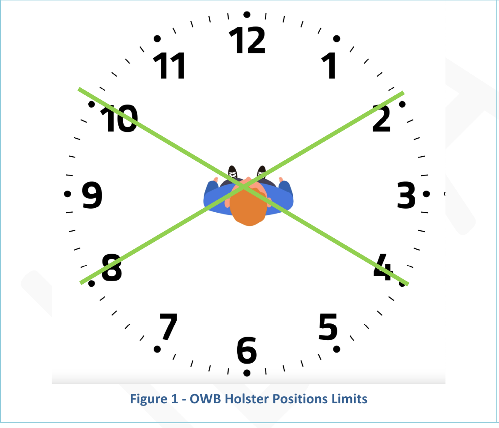
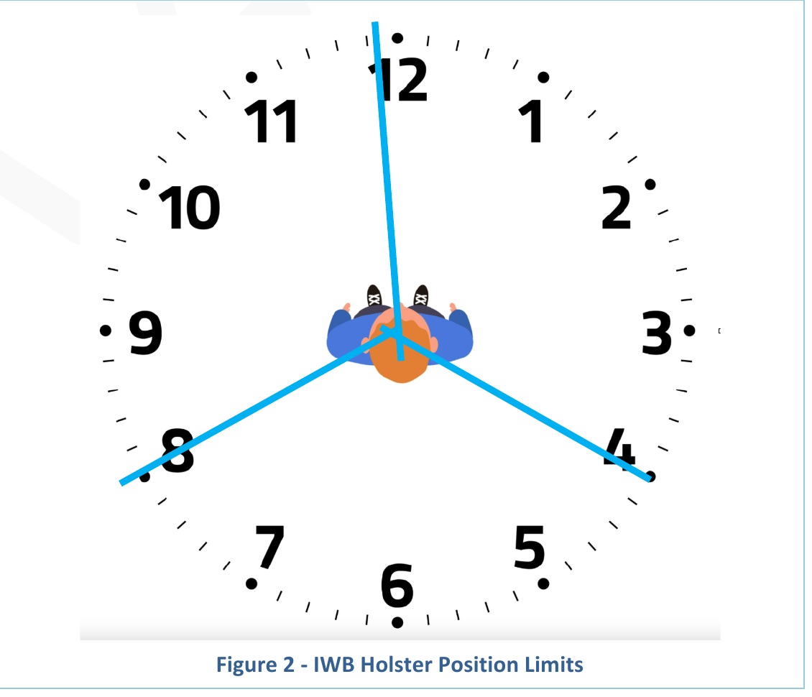
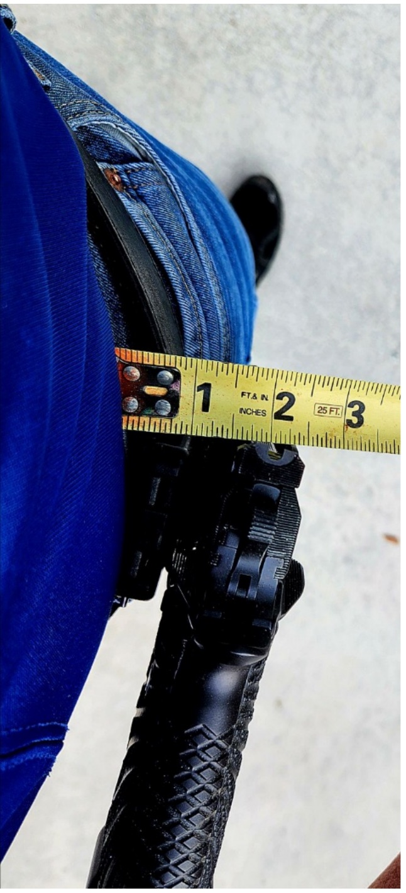

# 2025 IDPA Rulebook

150 CR 4603 Bogata, Texas 75417
Phone: 870-545-3886
www.idpa.com

COMPETITION AND EQUIPMENT RULES OF THE INTERNATIONAL DEFENSIVE PISTOL ASSOCIATION, INC.

Ver. 2025
Adopted 10/26/96, amended 2/1/25
© 1996-2025 International Defensive Pistol Association, Inc. All rights reserved.

## Contents

1. THE FOUNDING CONCEPTS OF IDPA — 2
2. SAFETY RULES — 4
3. SHOOTING RULES — 10
4. SCORING RULES — 15
5. PENALTY RULES — 22
6. STAGE DESIGN RULES — 24
7. PERMANENTLY PHYSICALLY DISABLED SHOOTER (PPDS) RULES — 27
8. EQUIPMENT RULES — 28
9. CLASSIFICATION RULES ARE LOCATED IN THE MATCH ADMINISTRATION RULES — 35
10. APPEALS PROCESS — 36
11. INDEX — 38

# 1 THE FOUNDING CONCEPTS OF IDPA

Founded in 1996, the International Defensive Pistol Association (IDPA) is the governing body for IDPA competition, a handgun caliber shooting sport based on simulated self-defense scenarios.

The IDPA competition format was designed to be enjoyable for all shooters of all skill levels, with a premium put on the social interaction and camaraderie of the members. Participation in IDPA matches requires the use of firearms, holsters and other equipment suitable for concealed carry self-defense. With that in mind, and keeping the shooters' best interests in mind, IDPA's founders established equipment requirements that are based on commonly available firearms and gear, allowing individuals the opportunity to compete with minimal investment.

Today, thanks to the vision of its founders and a commitment to serving the organization's loyal membership, IDPA stands as one of the fastest growing shooting sports in the United States with over 25,000 members from all 50 states, and over 400 affiliated clubs hosting weekly and monthly competitions, and membership representing over 70 nations.

Our main goal is to test the skill and ability of the individual. Equipment that is designed with no application for daily, concealed carry is not permitted in this sport.

## 1.1 IDPA's Fundamental Principles

1.1.1 The Fundamental Principles are a guide to all members.

1.1.1.1 Promote safe and proficient use of firearms and equipment suitable for concealed carry self-defense.

1.1.1.1 Offer a practical shooting sport encouraging competitors to develop skills and fellowship with like-minded shooters.

1.1.1.2 Provide a level playing field for all competitors that solely tests the skill and ability of each individual, not their equipment.

1.1.1.3 Provide separate divisions for equipment and classifications for shooters, such that firearms with similar characteristics are grouped together and people with similar skill levels compete against each other.

1.1.1.4 Provide shooters with practical and realistic courses of fire, and test skills that could be required to survive life-threatening encounters.

1.1.1.5 Strongly encourage all IDPA members to support our sponsors when making purchases of equipment and accessories. Industry sponsors have been instrumental in IDPA's success at all levels including Club, State, Regional, National, and International levels.

1.1.1.6 Develop and maintain an infrastructure that will allow IDPA to be responsive to our shooters. While IDPA can never be all things to all people, respectful constructive suggestions from our members, which follow IDPA Fundamental Principles, will always be welcome.

## 1.2 Principles of Shooting IDPA

1.2.1 Equipment Principles

1.2.2 Allowed equipment will meet the following criteria:

1.2.2.1 Concealable: All equipment will be placed so that it is not visible while wearing a concealment garment, with your arms extended to your sides, parallel to the ground.

1.2.2.2 Practical: All equipment must be practical for all day concealed carry self-defense, and worn in a manner that is appropriate for all day continuous wear.

1.2.3 Participation Principles

1.2.3.1 Competitors will not attempt to circumvent or compromise any stage by the use of inappropriate devices, equipment, or techniques.

1.2.3.2 Competitors will refrain from unsportsmanlike conduct, unfair actions, and the use of illegal equipment.

1.2.3.3 The IDPA Rulebook is not intended to be an exhaustive description of all allowed and disallowed equipment and techniques. Shooter equipment and techniques should comply with the basic principles of IDPA and be valid in the context of a sport that is based on self-defense scenarios. A reasonable application of common sense and the IDPA Founding Concepts will be employed in determining whether a device, technique, or piece of equipment is permitted under the IDPA rules. The lack of a prohibition about a specific action or piece of equipment does not equal permission. The final determination rests with the AC/IPOC/or RACL.

1.2.3.4 At its core, IDPA is a self-defense scenario-based sport. The props used to create the Course of Fire (CoF) are often incomplete but represent buildings, walls, windows, doorways, etc. The CoF will indicate available shooting positions.

1.2.3.5 Individual rehearsals of a CoF, including air gunning and taking sight pictures, are not permitted within the CoF boundaries.

1.2.3.6 Shooting from behind cover is a basic premise of IDPA. Competitors must use available cover in a CoF.

1.2.3.7 IDPA is a shooting sport based on concealed carry and in any single contest a shooter must use the same firearm on all stages unless the firearm becomes unserviceable.

1.2.3.8 Re-shoots are allowed for stage equipment failures or SO interference.

1.2.3.9 English is the official language of IDPA. Range commands used in all matches regardless of location or nationality of participants, will be in English. The English rulebook prevails.

1.2.4 Course of Fire Principles

1.2.4.1 One issue critical to the long-term success of this shooting discipline is that problems shooters are asked to solve must reflect self-defense principles. The IDPA founders agreed upon this when they set out to structure IDPA guidelines and principles. IDPA should help promote basic sound gun handling skills and test skills a person would need in a concealed-carry encounter. Requirements such as the use of cover while engaging a target, reloading behind cover, and limiting the number of rounds per string were all based upon that principle.

1.2.4.2 "String of Fire" refers to a section of the course of fire that is initiated by a start signal, and ends with the last shot fired. There may be more than one string in a stage.

1.2.4.3 "Cover" refers to a position where a shooter can engage targets with a portion of their upper and lower body behind an object such as a wall.

1.2.4.4 A CoF should test a competitor's shooting skills. Allowances will be made for physically challenged or disabled shooters. Match Directors should always attempt to make the CoF accessible for all shooters.

1.2.4.5 While we recognize that there are many schools of thought in training for self-defense concealed carry, the primary focus of IDPA is in the continuing development of safe and sound gun handling skills that are universally accepted.

1.2.4.6 IDPA rules will be equally enforced for all classifications of IDPA members.

# 2 SAFETY RULES

## 2.1 Cooper's Four Basic Rules

Colonel Jeff Cooper's Four Basic Rules of Firearm Safety have appeared in the beginning pages of books, videos, and training courses for more than 30 years. They are time honored and although they are not IDPA safety rules, they serve as the foundation of the safety rules below.

- All guns are always loaded.
- Never let the muzzle cover anything you are not willing to destroy.
- Keep your finger off the trigger till your sights are on the target.
- Identify your target, and what is behind it.

The Safety Rules below serve as the cornerstone for every IDPA shooter to follow, including Safety Officers (SOs), Match Directors (MDs), and Area Coordinators (ACs), so that our events are safe and enjoyable to a wide range of participants. They are to be adopted for all IDPA events.

## 2.2 Unsafe Firearm Handling

Unsafe firearm handling will result in immediate Disqualification (DQ) from an IDPA match. The following is a non-exclusive list of unsafe behaviors.

2.2.1 Endangering any person, including yourself. This includes sweeping oneself or anyone else with a loaded or unloaded firearm. Sweeping is defined as allowing the muzzle of the firearm (loaded or unloaded) to cross or cover any portion of a person.

2.2.1.1 Exception: A match Disqualification is not applicable for sweeping of the shooter's own body below the belt while removing the firearm from the holster or holstering of the firearm, provided that the shooter's trigger finger is clearly outside of the trigger guard. However, after the muzzle of the firearm is clear of the holster and has rotated up on the draw, sweeping any part of the body is a Disqualification.

2.2.2 Pointing the muzzle beyond designated "Muzzle Safe Points" if used, or beyond the 180-degree Muzzle Safe Plane if used.

2.2.3 Intentionally engaging (discharging the firearm) at anything other than a target or an activator.

2.2.4 A discharge:

2.2.4.1 in the holster.

2.2.4.2 striking up range of the shooter.

2.2.4.3 into the ground downrange closer to the shooter than 2 yards, unless engaging a low target that is within 2 yards.

2.2.4.4 over a berm.

2.2.4.5 during Load and Make Ready, Unload and Show Clear, Reload, or Malfunction Clearance.

2.2.4.6 before the start signal.

2.2.4.7 while transferring a firearm from one hand to the other.

2.2.4.8 while handling a firearm except at the firing line.

2.2.5 Removing a firearm from the holster, unless:

2.2.5.1 With verbal instruction from a SO.

2.2.5.2 While engaging targets in a CoF under the direct supervision and visual contact of a SO.

2.2.5.3 When in a designated "Safe Area."

2.2.6 Pointing the muzzle over the berm during the "Pull the Trigger" portion of Unload and Show Clear.

2.2.7 Drawing a firearm while facing up range.

## 2.3 Dropping A Firearm

2.3.1 Dropping a loaded or unloaded firearm or causing it to fall, during Load And Make Ready, the shooting of a string or stage, reloads or malfunction clearance or during Unload and Show Clear will result in disqualification from the match. If a shooter drops a firearm, the SO will immediately give the command "Stop". The SO will pick up/recover the dropped firearm and render it safe and unloaded before returning it to the shooter. The shooter will be disqualified from the IDPA match.

2.3.2 If a shooter drops a loaded or unloaded firearm or causes it to fall within a stage boundary, the shooter is disqualified from the match.

2.3.3 Dropping an unloaded firearm or causing it to fall while outside of stage boundaries is not within IDPA's control and is subject to local Range policy.

## 2.4 Ear and Eye Protection

2.4.1 Ear protection and impact resistant eye protection are required to be used by everyone attending an IDPA shooting event. The responsibility for safe and serviceable ear and eye protection falls completely on the shooter or spectator. IDPA recommends that hearing protection have a minimum 21dB NRR rating and that eye protection have a minimum ANSI Z87.1 impact rating and side shields.

2.4.2 The SO will stop a shooter that has started a CoF and is not wearing proper eye or ear protection, and a reshoot will be given to the shooter. If the shooter's eye or hearing protection becomes dislodged during a CoF, the same action applies. If the shooter discovers missing or dislodged eye or hearing protection before the SO and stops, the shooter will also be given a reshoot.

2.4.3 A shooter who intentionally loses or dislodges eye and/or ear protection during a CoF will be disqualified.

## 2.5 Pistol Serviceability

Pistols used in competition will be serviceable and safe. The responsibility for safe and serviceable equipment falls completely on the shooter. The MD will require a shooter to withdraw any pistol or ammunition observed to be unsafe. In the event that a pistol cannot be loaded or unloaded due to a broken or failed mechanism, the shooter must notify the SO, who will take such action as he/she thinks safest.

## 2.6 Fingers

2.6.1 Fingers must be obviously and visibly outside the trigger guard during loading, unloading, drawing, holstering, while moving (unless engaging targets) and during malfunction clearance.

2.6.1.1 First offense is a Procedural Error penalty.

2.6.1.2 Second Offense is a DQ from the match.

2.6.1.3 Each "Finger" violation will be clearly noted on the shooter's score for tracking purposes.

## 2.7 Pistol Carry Condition

The normal condition of pistols not in use during a CoF is holstered and unloaded, with hammer down or striker forward and magazine removed or cylinder empty. Magazines, speed loaders, and moon clips may be reloaded while off the firing line, but the shooter's firearm can be loaded or unloaded only under the direction of the SO.

## 2.8 Start Conditions

All strings of fire will be started with the pistol holstered, safeties engaged as required by different divisions, and hands clear of equipment including the concealment garment unless other positions for the pistol are stipulated in the written stage description (table top, drawer, pack, purse, in the firing hand, etc.).

## 2.9 Muzzle Safety

2.9.1 There are three types of muzzle safe area indicators used in IDPA. The written stage description will describe which type of muzzle safe areas are used or if multiple types are used in concert. All three types may exist on a single stage, however if no muzzle safe cones or flags are present on a stage, the default is the 180° Plane.

2.9.1.1 Muzzle Safe Points: A Muzzle Safe Point is a physical and clearly visible marker such as a traffic cone or stake in the ground with a brightly colored flag or marker tape attached.

2.9.1.2 180-Degree Plane: The 180° plane is an imaginary infinite vertical plane drawn through the centerline of the shooter's body, perpendicular to the centerline of the shooting bay that moves with the shooter as the shooter moves through the stage. When facing downrange, the violation of the 180-degree plane when drawing from a muzzle rearward holster configuration or while holstering a firearm into a muzzle rearward holster configuration is not an infraction. If the muzzle of the shooter's firearm points further up range than a "Muzzle Safe Point" the shooter will be disqualified from the match. The shooter will be given the command "Stop." The shooter will stop immediately, place the trigger finger obviously and visibly outside the trigger guard of the firearm, and wait for further instructions from the SO.

2.9.1.3 Muzzle Exclusion Zone: Muzzle Exclusion Zones must be marked on doors/ports/windows that the shooter is required to open during the CoF. This type of muzzle safe point designates a keep out area and should be a minimum dimension of 6" square. If the muzzle points at this keep out area while the shooter is touching the marked area doorknob/handle, the shooter will be disqualified.

## 2.10 Safe Areas

2.10.1 Safe Areas must be provided for all local and sanctioned matches, in convenient locations and in numbers adequate to handle the volume of expected shooters. A Safe Area is defined as a designated area where the following rules apply The violation of any of the cases below will result in disqualification from the match:

2.10.1.1 Each Safe Area must be clearly identified by visible signage, and include a table with the safe direction and boundaries clearly shown.

2.10.1.2 Unloaded firearms may be handled at any time. This area is used for bagging or un-bagging a firearm, holstering, drawing, dry firing, or equipment adjustment.

2.10.1.3 A Safe Area may also be used for inspections, stripping, cleaning, repairs, and maintenance of firearms, empty ammunition feeding devices, or related equipment.

2.10.1.4 The muzzle of the firearm must be pointed in a safe direction.

2.10.1.5 Handling of ammunition, loaded ammunition feeding devices, loose rounds, dummy ammunition, snap caps, simunitions, training rounds, or loaded firearms is not permitted in safe areas.

2.10.1.6 A Safe Area may also be used, while accompanied by a SO, to render safe a firearm that has locked up and contains a live round or rounds.

2.10.1.7 Reload practice within the Safe Area is not allowed. An empty magazine may be inserted into a firearm to test functionality or to drop the hammer on a firearm with a magazine disconnect, but reload practice is prohibited.

## 2.11 Hot and Cold Ranges

The question of Hot and Cold ranges at the local club level is subject to individual club policy. This issue is the sole responsibility of local clubs and is beyond IDPA's control. Matches sanctioned by IDPA are required to operate under the Cold range rule, but may use Hot Bays if desired.

2.11.1 Cold Range

2.11.1.1 A "Cold Range" is defined as a range where all firearms must be unloaded unless under the direct supervision of an SO.

2.11.2 Cold Range with Hot Bays

2.11.2.1 A "Cold Range with Hot Bays" is defined as a range that does not allow loaded firearms in the holster outside of the shooting bays but does allow for loaded firearms in the holster within the shooting bays as directed by and under the supervision of the Sos. Loaded firearms may only be handled while on the firing line when the shooter is given specific Range Commands and is under the direct supervision of a SO.

2.11.2.2 With direct supervision from the SO, and when given specific Range Commands, an entire squad of shooters will line up across the bay, face down range and will "Load And Make Ready" as a group.

2.11.2.3 The perimeter of the bay will be well defined as well as any area designated as a "Safe Area" where handling of ammunition and loaded firearms is not permitted. A procedure for requesting to be unloaded to exit the bay will be established by the CSO and explained to all participants during the stage briefing. If a shooter for any reason needs to leave a Hot Bay, the shooter must contact one of the Sos in that bay to safely unload the firearm before leaving the bay.

2.11.2.4 If a shooter for any reason does not wish to load his firearm with the group, the shooter is not to be penalized.

2.11.3 Hot Range

2.11.3.1 A Hot range is defined as a range where each shooter has the choice to carry a loaded firearm at any time. Loaded or unloaded firearms may only be handled while on the firing line and under the direct supervision of a SO.

## 2.12 Range Commands

Many of the range commands given to a shooter by the SO are for safety, while the rest are for stage administration. To allow a shooter to compete anywhere in the world and hear the same commands, the IDPA range commands will only be given in English, the official language of IDPA. These exact range commands must be used, and local variations are not allowed.

2.12.1 Range Is Hot

2.12.1.1 This is the first command given to each shooter starting the action of shooting a stage. This command signifies the start of the CoF. The shooter will make sure that their eye and hearing protection is in place. It is also notification to anyone in the shooting bay to check that their own eye and hearing protection is properly fitted.

2.12.2 Load and Make Ready

2.12.2.1 When the shooter has proper eye and hearing protection, the SO will issue the Load and Make Ready command. The shooter will prepare the firearm and magazines to match the required start position for the stage. Typically, this is to load the firearm and holster. After loading the firearm, holstering will be performed by the shooter while standing with the proper care to insure the firearm is free of anything inside the trigger guard and the muzzle is oriented away from the shooters body for safety. Additional options may include non-typical loading or staging of equipment. The shooter will then assume the starting position necessary for the stage. If the shooter's firearm is not to be loaded for the start of a stage the command used will be "Make Ready." Any additional actions that appear as a rehearsal are not permitted.

2.12.3 Are You Ready?

2.12.3.1 After "Load and Make Ready," the SO will ask the shooter "Are You Ready?" If ready, the shooter should respond verbally, or by obvious nodding of the head, but may also choose to stand ready. If there is no response from the shooter in approximately 3 seconds, the shooter is considered to be ready.

2.12.3.2 If the shooter is not ready when this question is asked the shooter must respond "Not Ready". If the shooter continues to not be ready, the shooter must take a step out of the starting position. When ready, the shooter will assume the starting position and the "Are You Ready" question will be asked again.

2.12.3.3 The shooter is expected to be ready to proceed approximately 15 seconds after the "Load And Make Ready" command. If the shooter is ill prepared and needs more than fifteen seconds to get ready, the shooter will be advised that the shooter is being given approximately 15 seconds more to prepare. If the shooter is still not ready after that period, shooter will receive a Procedural Error penalty and will be moved down in the shooting order.

2.12.4 Standby

2.12.4.1 This command is given after the shooter is ready. This command will be followed by the start signal within 1-4 seconds. The shooter may not move or change positions between the "Standby" command and the start signal, unless required to do so by the CoF.

2.12.5 Finger

2.12.5.1 This command is given when the shooter's finger is not obviously and visibly outside the trigger guard when it should be, as noted in section 2.6. The shooter is not required to hear or acknowledge the command prior to scoring.

2.12.6 Muzzle

2.12.6.1 This command is given as a warning when the muzzle of the shooter's firearm is pointed near a muzzle safe point. The shooter must correct the errant muzzle and continue with the stage.

2.12.7 Stop

2.12.7.1 This command is given when something unsafe has happened or is about to happen during a stage, or when something in the stage is not correct. The shooter must immediately stop all movement, place the trigger finger obviously and visibly outside the trigger guard, and await further instruction. Failure to immediately stop and remove the trigger finger from within the trigger guard will result in Disqualification from the match.

2.12.8 If Finished, Unload and Show Clear

2.12.8.1 This command will be issued when the shooter has apparently finished shooting the stage. If the shooter is finished, all ammunition will be removed from the firearm and a clear chamber/cylinder will be shown to the SO. If the shooter is not finished, the shooter should finish the stage and the command will be repeated.

2.12.9 If Clear, Slide Forward or Close Cylinder

2.12.9.1 Once the Shooter has inspected the chamber/cylinder and found it to be clear, this command will be issued, and the shooter will comply (see PCC Appendix for PCC specific range commands).

2.12.10 Pull the Trigger

2.12.10.1 The shooter will point the firearm at a safe berm and pull the trigger to further verify that the chamber is clear. If the firearm fires, the shooter will be disqualified from the match. This requirement also applies to firearms with a de-cocker or magazine disconnect. For firearms with a magazine disconnect, an empty magazine, or dummy magazine must be inserted before the trigger is pulled, and then removed again. This command is not needed for revolvers.

2.12.11 Holster

2.12.11.1 The shooter will safely holster the firearm.

2.12.12 Range is Clear

2.12.12.1 This command indicates to everyone within the stage boundaries that the range is clear. This command ends the CoF and begins the scoring and resetting of the stage.

## 2.13 Club Safety Rules

Ranges that host IDPA matches may have additional or more restrictive safety requirements. These safety restrictions will be accommodated by the IDPA MD and staff provided that they do not interfere or conflict with the Purpose and Principles of IDPA or the administration of the match according to the IDPA Safety Rules. Any additional restrictions or requirements must be published in all match announcements and visibly displayed at the match in a location accessible to the shooters.

## 2.14 Steel Targets

Steel Targets must be engaged from 10 yards or more. If a shooter engages a steel target from less than 10 yards the shooter will be disqualified.

## 2.15 General Maintenance

The MD should make every effort to ensure that all items used in an IDPA match are in good condition and safe as used. This includes permanent fixtures in the shooting bay, the bays themselves, berms, props, static and moving targets, target holders, doors, walls, barrels, tables, reactive targets, etc.

# 3 SHOOTING RULES

## 3.1 Shooting Actions

Shooting Actions are attributes of shooting. Examples of shooting actions are requiring one handed shooting, or shooting from a specified shooting position, such as standing freestyle, retention, crouching, kneeling, sitting, or prone, etc. Match Directors may indicate to shooter in the procedure the determinate factors that define sitting, kneeling, or prone, etc.

## 3.2 Target Engagement

3.2.1 Tactical Priority is a method of target engagement in which targets are engaged by their order of threat. Threat is based on the distance of the visible threats from the shooter.

3.2.1.1 All targets must be engaged in tactical priority, including all targets engaged "in the open."

3.2.1.2 Targets are considered equal threat when the difference in the target distances to the shooter is less than 2 yards.

3.2.1.3 If several targets are visible at the same time, targets are engaged from near-to-far unless they are equal threat.

3.2.1.4 If targets are hidden by vertical cover, the targets are engaged as they become visible around the edge of cover.

3.2.2 A target is considered "Engaged" when:

3.2.2.1 A cardboard target is deemed to have been engaged when the required number of shots for that target have been fired at the target.

3.2.2.2 Body and head shots may be required on an individual visible cardboard target and must be shot in the order and quantity stipulated in the CoF. Failure to shoot one or more targets in the required body then head order earns the shooter a single Procedural Error (PE).

3.2.2.3 A reactive target is deemed to have been engaged when a minimum of 1 round is fired at the target, regardless of whether the target reacts. All penalties apply if the shooter does not re-engage the target until the target reacts or if the shooter unsuccessfully challenges the reactive target calibration.

3.2.2.4 A cardboard target with a steel activator behind it is considered engaged when the required number of shots are fired at the cardboard target.

3.2.3 When an activator reveals a target of equal or higher Tactical Priority, the shooter may interrupt the engagement in any order to engage the target/s of equal or higher Tactical Priority without retreating.

3.2.4 Target engagement penalties shall not apply in the following cases:

3.2.4.1 Failing to fire the required number of shots at a disappearing target.

3.2.4.2 On the shooter's order of target engagement when the targets are of equal priority.

3.2.4.3 When re-engaging targets elsewhere in the stage provided the shooter does not break the defined Muzzle Safe Points.

3.2.4.4 Shooter may re-engage a target freestyle once the Course of Fire (CoF) engagement requirement for that target has been satisfied.

## 3.3 Walkthroughs

3.3.1 Prior to shooting a stage, a group walkthrough will be given by the SO. During the group walkthrough, the SO will verbally indicate to all shooters the vision barriers and points of cover for each target and fault lines. During the group walkthrough, the SO will also indicate to shooters all special conditions for the stage. Each shooter will be allowed to view each target from every shooting position. This includes taking a knee or going prone.

3.3.2 Other than the group walkthrough, no individual stage walkthroughs are permitted. Individual walkthroughs include walking the path of fire or assuming shooting positions for the purpose of checking cover positions or target engagement, order, etc.

3.3.3 Air gunning is not permitted. Air gunning is the act of going through rehearsal motions of firing all or portions of the stage with a hand or pointed finger while within the stage boundaries.

3.3.4 Stage Boundaries mark the region wherein the shooter becomes subject to the rules of air gunning, sight picture and an individual walkthrough.

## 3.4 Reloads

3.4.1 An "emergency reload" is when the magazine/cylinder and the chamber are both empty in the firearm, and is the preferred reload for IDPA competition.

3.4.2 The shooter initiates a reload by performing any one of the following actions:

3.4.2.1 Withdrawing a magazine, speed loader or moon clip from a carrier, pocket or waistband.

3.4.2.2 Activating the magazine release on a semi-auto pistol (as evidenced by the magazine falling from the firearm)

3.4.2.3 Opening the cylinder of a revolver.

3.4.3 A firearm is deemed to be reloaded when the magazine is seated and the slide is in battery or the revolver cylinder is closed. The firearm must contain at least one unfired cartridge in the chamber, magazine, or cylinder.

3.4.4 If the shooter "drops" or "racks" the slide prior to leaving a Position of Cover and the slide fails to go fully into battery, this is considered a malfunction and no penalty shall be assessed.

3.4.5 A firearm is deemed empty when there is no live ammunition in the chamber or magazine for semi-autos, or there is no live ammunition in the cylinder for revolvers.

3.4.6 Shooters may not perform a reload which results in a loading device with ammo being left behind. This is commonly known as a "speed reload", and will result in a Procedural Error penalty being issued.

3.4.6.1 Ejected magazines with ammo do not need to be stowed if spare magazines start staged in a shooting position and the shooter does not leave that position.

3.4.7 Dropping a loaded magazine or speed loader/moon clip does not incur a penalty as long as the shooter retrieves and properly stows the loaded magazine or speed loader/moon clip prior to the firing of the last shot in the string of fire.

3.4.8 When clearing a malfunction, the magazine or speed loader/moon clip and/or ammunition that may have caused the malfunction does not need to be retained by the shooter and will incur no penalty if dropped.

3.4.9 Firearms and magazines must always be loaded to the shooter's division capacity, unless otherwise specified by the CoF.

3.4.10 Firearms and magazines manufactured such that they cannot be loaded to the division capacity may still be used as long as they are loaded to their maximum capacity and meet all other criteria for that division. Refer to 8.1.3 for additional information.

## 3.5 Cover and Concealment

3.5.1 Cover refers to a barrier that exists between the shooter and the targets to be engaged. Hard Cover is meant to stop bullets, any hits on or passing through simulated Hard Cover will not be scored. Walls, Barricades, and Vehicles are some examples of Hard Cover. Hard Cover may also be simulated through the use of black paint or black covering material on targets and/or props.

3.5.2 Vertical Cover requires the shooter to engage targets from the side(s) of the (PoC) Position of Cover.

3.5.3 Horizontal Cover requires the shooter to engage targets over or under the (PoC) Position of Cover.

3.5.4 Concealment refers to hidden from sight. Concealment such as Vision Barriers, and Soft Cover refers to a penetrable barrier used to obscure a shooters position from targets, such as bushes or a curtain.

3.5.5 "In the open" refers to a position where the shooter must engage targets with no cover or concealment between the shooter and the target(s).

3.5.6 When cover is available it must be used, while engaging targets, unless the shooter is "in the open" and forced to engage targets "in the open." Shooters may not cross or enter any openings (doorways, open spaces, etc.) without first fully engaging all targets visible from those locations.

3.5.7 Stages will have one or more of the following cover situations:

3.5.7.1 There is no cover anywhere in the stage, so reloading (emergency and topping off) with up to 18 rounds per string are allowed "in the open."

3.5.7.2 The shooter engages all targets from cover.

3.5.7.3 When starting in the open, up to 6 shots may be required on targets while the shooter is stationary or moving to the first position of cover.

3.5.7.4 When moving between two positions of cover, no more than 6 shots may be required on "discovered" or "surprise" targets hidden behind a vision barrier or revealed by activation.

3.5.8 For vertical cover when shooting, a shooter must remain within the fault lines.

3.5.9 Low cover can be at either a position of vertical or horizontal cover and requires at least one knee touching the ground.

3.5.10 (deleted)

3.5.11 Cover During Reloads

3.5.11.1 When the shooter runs the firearm empty in the open or from behind concealment, the shooter may reload and continue engaging targets as needed or move to the next shooting position to complete the engagement.

3.5.11.2 In stages with cover, shooters may reload standing still or on the move at any time, as long as they are not exposed to targets that are not fully engaged during the reload. (Standard stages may require multiple engagements of a target array in a single string so the procedure will dictate the correct action for a stage.)

3.5.11.3 Vision Barriers provide concealment to the shooter, but offer no protection from a threat. This allows movement through a stage. When the shooter runs the firearm empty, they are considered to be in the open.

3.5.11.4 Shooter exposure to multiple target arrays while engaging targets: Engaging targets from distant cover beyond the end of a fault line is not itself a penalty. However while using distant cover, if a shooter is exposed to other unengaged targets associated with a different shooting position they incur a penalty under 3.5.6. if not within a physical fault line at a Position of Cover (e.g. a shooter in an open area between positions of cover)

## 3.6 Fault Lines

3.6.1 Fault Lines must be employed by Match Directors to mark the limit of a Position of Cover or shooting positions for a CoF.

3.6.2 Fault lines must be used in such a way that they are consistent for each shooter. Examples of fault line materials are a physical barrier such as a barrel or short wall, a tightly stretched rope, dimensional lumber, angle iron, tape, paint or a flat metal bar.

3.6.3 Faulting the Line is defined as the shooter touching the ground or other objects on the opposite side of the fault line.

3.6.4 When Fault Lines are used to delineate a Position of Cover (PoC):

3.6.4.1 Fault Lines are used to ensure a shooter is behind cover when engaging targets from a shooting position or Position of Cover. There will only be one Fault Line at each possible PoC, and that line applies to all targets visible from that PoC.

3.6.4.2 Fault Lines used to delineate cover must start at the cover object (e.g., wall, barrel, etc.) and extend back away from cover in the up-range direction. The object used to mark the line must extend back away from the cover object at least 3 feet but not more than 8 feet.

3.6.4.3 A shooter who engages a target while faulting the line shall be assessed a PE.

3.6.4.4 Other measurement methods for determining cover must not be employed.

3.6.5 When Fault Lines are used to limit a shooters movement (e.g. shooting in the open from behind a fault line):

3.6.5.1 A shooter who engages a target while faulting the line shall be assessed a PE.

3.6.6 Match designers may terminate the end of a fault line, into an object, such as a barrel, to further delineate shooting positions and positions of cover.

3.6.7 Nested / Overlapping Fault Lines: Shooters shall not advance across fault lines in a way that exposes them to unengaged targets. Fault lines are not cover themselves. They restrict movement beyond a shooting position for unengaged targets which are exposed to the shooter.

## 3.7 Start Position

3.7.1 Once the shooter has assumed the "start position" and the "Standby" command has been given, the shooter's physical position may not be changed prior to the start signal, with the exception of head movements, provided such movements do not contradict the ready position requirements specified in the stage description.

3.7.2 Unless specified otherwise in the stage description, the default ready position requires the shooter to stand erect with the body relaxed and hands resting naturally at sides.

3.7.3 If an SO determines that a shooter was allowed to start in an incorrect start position (at the time the "Standby" command was given,) a reshoot is mandatory and no penalty is assessed. Note: This rule does not apply to equipment start condition (e.g., loaded with correct number of rounds or wearing a concealment garment).

3.7.4 When a stage is started in an incorrect start position and the shooter notices, but the SO does not notice, the shooter must request a reshoot immediately following the holster command and prior to the scoring of targets. If not requested during this period, no reshoot will be allowed.

## 3.8 Reshoots

3.8.1 Shooters cannot reshoot a stage or string for firearm or "mental" malfunctions.

3.8.2 Reshoots are mandatory for stage equipment malfunctions.

3.8.3 A stage equipment malfunction is defined by having a prop fail in a way that it changes the scoring outcome for a shooter during that time. Unpasted targets, or having pasters fall off targets are not considered stage malfunctions unless the Match Director cannot determine the score for the shooter.

3.8.4 If an SO feels he has interfered with a shooter, he will offer an optional reshoot to the shooter immediately following the "range is clear" command and prior to the scoring of targets, as determined by the SO.

3.8.5 If a shooter feels he has been interfered with by an SO, the shooter must request a reshoot immediately following the "range is clear" command and prior to the scoring of targets. The MD will determine if a reshoot request is granted.

## 3.9 Firearm Hand Usage Restrictions – Stage Description

3.9.1 Freestyle: A denotation in a stage description that the shooter may use either hand or both hands to control the firearm while firing, at the shooter's discretion.

3.9.2 Strong/Dominant Hand Only: A denotation in a stage description indicating that only the strong or dominant hand (the shooter's primary firing hand, located on the same side of the body as the holster) can be used to control the firearm when a shot is fired. The weak (support) hand or arm must not touch the firearm or any location on the shooter's strong (dominant) arm or hand when firing (excluding PCC). For safety reasons, both hands may be used when clearing a malfunction or reloading. For PCC the firearm must be shouldered on the strong hand side, trigger pulled with the strong hand. Both hands may be on the gun.

3.9.3 Weak/Support Hand Only: A denotation in a stage description indicating that only the weak or non-dominant hand, i.e., the shooter's support hand, located on the opposite side of the body from the holster, can be used to control the firearm when a shot is fired. The strong (dominant) hand or arm must not touch the firearm or any location on the shooter's weak (support) arm or hand when firing (excluding PCC). For safety reasons, no weak hand drawing from the holster is allowed and both hands may be used when clearing a malfunction or reloading. For PCC the firearm must be shouldered on the weak side of the body, the trigger must be pulled with the weak hand. Both hands may be on the gun.

3.9.4 Retention is an action defined by shooting with strong side elbow, forearm or wrist held against their strong side torso while engaging.

3.9.4.1 Shooter may elect to shoot using strong hand only or both hands for required retention shots.

## 3.10 Flashlight Usage Rules

3.10.1 If a shooter is required or elects to use a flashlight on a stage, the flashlight (for pistol divisions) must be concealed and turned off at the start of the stage, unless otherwise dictated in the CoF.

3.10.1.1 Once the stage begins, the flashlight may be left on during the entire stage at the shooter's discretion.

3.10.1.2 Shooters must retain the flashlight throughout the course of fire.

3.10.1.3 Dropping a flashlight does not incur a penalty as long as the shooter retrieves the flashlight prior to firing the next shot in the string of fire. This rule does not exempt dropped firearms.

3.10.1.4 If a shooter drops a flashlight, the SO may, at their discretion, illuminate the area for safety reasons until the shooter retrieves the flashlight. This will not be deemed SO interference.

3.10.1.5 The shooter's flashlight may be used to recharge night sights any time after the start signal, but not prior.

3.10.1.6 When a shooter elects to place a weapon mounted light on their handgun, for use at any time during a match, the shooter will be required to pass an equipment inspection, for the division entered with the box and weight restrictions for the division, with the flashlight mounted as used on the stage. If this is mid match, the shooter will be escorted back to the equipment inspection before moving on to the next stage.

## 3.11 Responsibilities and Code of Conduct

3.11.1 By shooting IDPA Matches or as a member of IDPA, I agree to the following:

3.11.1.1 I understand that it is a privilege, and not a right, to be an IDPA Shooter.

3.11.1.2 I will follow all of the safety rules of IDPA and the host range. The safety of the shooters, match officials, and bystanders shall always be my primary objective.

3.11.1.3 Prior to and during a match, I will refrain from being under the influence of any altering substances, or medications that may negatively impact my ability to shoot safely.

3.11.1.4 I will maintain a current IDPA membership after my third match.

3.11.1.5 I will establish an accurate Classification by shooting a Classifier to compete for score.

3.11.1.6 I recognize that it is my responsibility to maintain a working knowledge of the current IDPA rulebook.

3.11.1.7 I will adhere to the IDPA purpose and principles and will not willfully break any IDPA rule.

3.11.1.8 I will listen carefully and refrain from talking during shooters' briefings and stage briefings.

3.11.1.9 I will refrain from any action that distracts shooters, safety officers, and other competitors during the match.

3.11.1.10 I understand it is my responsibility as a squad member to be ready to shoot when called to the line.

3.11.1.11 I understand it is my procedural duty as a squad member to help reset stages between shooters unless I am the current shooter, the on-deck shooter or have just finished shooting, unless instructed otherwise by a match official.

3.11.1.12 I will not communicate with others in a threatening, harassing, or abusive manner.

3.11.1.13 It is my responsibility to check my match scores within the verification period to see that they are correct.

3.11.1.14 It is my responsibility to check my Classifications in the on-line database to verify that they are correct and to initiate corrective action if they are not correct.

3.11.1.15 If I have a question or an issue, my first contact is with the Chief Safety Officer at the match, then the Match Director, then the Area Coordinator, then the Regional Area Coordinator Lead, and then IDPA HQ.

3.11.1.16 I understand that violations of these responsibilities and Code of Conduct will result in my being penalized by the MD within the full range of penalties up to and including disqualification from a match, and may result in the revocation of my IDPA membership.

# 4 SCORING RULES

The scoring system in IDPA is designed to reward a balance of accuracy with speed. IDPA scoring converts everything to a time score and the lowest time wins. The scoring system is also designed to be very simple to understand and use.

The main thing to remember when scoring in IDPA is that everything is based on time; the raw time it takes to shoot a stage and the accuracy of the hits on the targets, where inaccuracy adds time to the score. Part of the simplicity of IDPA scoring comes from not using the total points of a target, and instead using points down on each target. Each point down adds 1 second to the time for the stage.

## 4.1 Unlimited Scoring

4.1.1 Unlimited Scoring allows the shooter to shoot at each target as much as deemed necessary, as long as this does not violate other IDPA rules. The best hits on a target are used for score. This gives the shooter the option to make up misses or hits that he or she are not satisfied with to improve their score. When the shooter does not fire enough rounds at a target, the unfired rounds are counted as misses and a Procedural Error penalty is assessed for not following the written stage description.

4.1.2 Each Course of Fire description will specify how many hits are required on each target. For example, if 3 hits are required on each target, then the best 3 hits will be scored if there are more than 3 hits on the target.

4.1.3 To tally an Unlimited score, take the time it took to complete the strings of fire (raw time from the shot timer) and total up the points down from each target. The raw time is added to the total points down for the stage multiplied by 1 second, and then added to any other penalties if applicable.

## 4.2 Limited Scoring

4.2.1 Limited Scoring operates just as the Unlimited Scoring method described above except the number of shots to fire in a string is limited to exactly the number specified in the written stage description.

4.2.2 Firing any extra shots in a string of fire will incur one Procedural Error penalty per string, and for each extra shot, one of the best scoring hits will be taped over before the score is calculated. When the shooter does not fire enough rounds at a target, the unfired rounds are counted as misses, a Procedural Error penalty is assessed for not following the written stage description i.e., not firing the required number of rounds.

## 4.3 Incomplete Stage (Stage DNF)

4.3.1 If a shooter has started a stage but cannot finish the stage due to a broken firearm, squib, or personal injury the score will be determined by writing down the time and scoring the stage as found by noting all points down (including misses), adding penalties for failing to engage and other applicable penalties. When you receive a beep, you receive a score.

4.3.2 If the SO stopped the shooter for a perceived squib, and it turns out not to be a squib, the shooter will be given a reshoot due to SO interference. If the SO stopped the shooter for a perceived squib, and it is a squib, the score will be determined per as above but no reshoot is given.

## 4.4 Did Not Finish Match (Match DNF)

1.1.2 A shooter that chooses not to shoot a stage will be given a DNF for that stage but may continue to shoot other stages for no total match score. At the completion of the match any shooter with a DNF score on any stage will result in a match DNF for that shooter.

## 4.5 Reasonable Doubt

4.5.1 When a Safety Officer has a reasonable doubt on a scoring call (including penalties) the SO will award the better score to the shooter. This also applies to possible doubles. However, this does not automatically mean that every miss is a double.

4.5.2 Video or still photography cannot be used to determine the shooter's score or appeal the decision of a Safety Officer, Chief Safety Officer, or Match Director.

4.5.3 Typically, bullet holes leave a grease ring, and it is used to determine the outside diameter of the hole for scoring. However, bullets do not have to have a grease ring to be scored as a hit. (e.g., bullets passing through other targets, clothing, soft cover, etc., may not produce a grease ring) so it is possible to allow the hit to be scored.

4.5.4 A radial tear must not be used to give a shooter a better score. If the actual area of the bullet hole does not reach the next better scoring ring, the shooter gets the lower score even if the tear reaches the next higher scoring ring.

## 4.6 Bullet Holes

4.6.1 Oval or elongated bullet holes made in a target that exceed two bullet diameters (of the caliber used by the shooter) do not count for score. This situation normally occurs for moving targets fired upon at extreme angles or targets where the shooter is moving.

4.6.2 The elongated bullet hole rule does not include keyhole bullet holes (a keyhole bullet hole is created by a bullet which tumbles out of the firearm barrel and appears to have gone through the target sideways,) which count for score.

4.6.3 Only holes made by whole bullets, not fragments, are scored.

4.6.4 Only bullet holes entering the front of the target will be scored.

4.6.4.1 Targets inadvertently mounted backwards during set up are not grounds for reshoots provided the targets are still able to be correctly scored.

## 4.7 Hard Cover/Soft Cover Scoring Implications

4.7.1 Stage props are commonly used to represent hard cover or impenetrable objects such as walls, cars, barricades, and furniture such as desks and file cabinets. Truly impenetrable objects may also be used as hard cover in a stage.

4.7.2 Props used to simulate walls are considered impenetrable and extend from the ground to infinity unless otherwise specified in the CoF. Simulated walls can have ports and/or windows within them for shooting or other purposes. Mesh and netting may be substituted for solid coverings and are always considered hard cover for scoring purposes.

4.7.3 IDPA requires that course designers standardize on Black for simulated hard cover. IDPA recommends that course designers standardize on White for soft cover simulation, or use props such as windows, curtains, shrubs, etc.

4.7.4 Any shot that puts a full diameter hole in an object designated as simulated hard cover and continues to penetrate a target will be considered to have missed the target, (whether the target is a threat or a non-threat). If the SO cannot tell which shot through hard cover hit a threat target, remove the best hit from the target for each full diameter hole in the hard cover.

4.7.5 Shots that penetrate soft cover and go on to strike a target will be scored as hits, (whether the target is a threat or a non-threat).

4.7.6 Simulated Threat and Non-Threat indicators painted or marked, regardless of color are not hard cover.

4.7.7 Threat indicators made of impenetrable material are considered hard cover.

4.7.8 Targets may be covered with clothing as desired. This is typically done with T-shirts, cut into a front half and a back half and one half is clipped or stapled onto the target sticks holding the target. Only a single layer of lightweight clothing material may be between the shooter and a target.

## 4.8 Threat and Non-Threat Target Designation

4.8.1 Non-threat targets must be designated by displaying a pair of normal sized open hands of contrasting color, at least one of which must be visible from all shooting positions where the target may be engaged.

4.8.2 Threat targets may be designated by displaying a normal sized threat indicator (like a firearm or knife) that is visible from all shooting positions where the target may be engaged.

4.8.3 Threat indicators of different kinds all have equal threat value and do not change target engagement priority. For example, a knife is equal in threat to a shotgun, rifle, or other firearms, or an unmarked target.

4.8.4 Threat and non-threat indicators may be painted or marked on the targets or covering clothing, or may be clipped or stapled to the target.

## 4.9 Shoot Through

When a bullet passes through both a non-threat target and a threat target, the shooter will get the penalty for the non-threat target hit and will get credit for the scored hit on the threat target. The reverse also applies when a round on a threat target penetrates a non-threat or threat behind it. All target shoot through hits count.

## 4.10 Target Scoring Zones

4.10.1 "Head" refers to the part of the cardboard IDPA silhouette above the neckline. Shots designated for the "head" or "head only" must hit the part of the cardboard silhouette within the scoring area above the neckline, or they are counted as a miss, even if they hit another part of the silhouette.

4.10.2 "Body" refers to the part of the cardboard IDPA silhouette below the neckline. Shots designated for the "body" or "body only" must hit the part of the cardboard silhouette within the scoring area below the neckline, or they are counted as a miss, even if they hit another part of the silhouette.

4.10.3 "Target" refers to the whole silhouette, including the head and body described above. Shots designated for a "target" (or sometimes T1, T2, etc.) can hit anywhere within the scoring area in the body or the head for score.

4.10.4 A single IDPA cardboard target must not be divided into two or more scoring areas that are scored separately. For example, a line of black tape may not be used to turn a single target into two targets, with separate scoring being possible on both areas.

## 4.11 Hit on Non-Threat

4.11.1 A Hit on a Non-Threat (HNT) is defined as a hit in any scoring zone of a target that is designated a non-threat. A reactive non-threat target (steel, reactive polymer, etc.) must react properly to a hit to be scored as a HNT.

4.11.2 Each hit on a Non-Threat adds 5 seconds to the shooter's score.

## 4.12 Targets

The following is an inclusive list of targets which are allowed:

4.12.1 All cardboard targets used in IDPA local, and Sanctioned Matches must be Official IDPA cardboard targets. Official IDPA cardboard targets are available from licensed IDPA target manufacturers in each geographical area. See our website at www.IDPA.com to find a vendor near you.

4.12.1.1 Cardboard targets may be stationary or moving. Threat targets will be scored as marked, as -0, -1, -3, and a miss is -5. Non-Threat targets are scored as -5 per hit regardless of marked scoring zones.

4.12.1.2 Cardboard targets may have their scoring area reduced by painting the non-scoring area with a high contrast color that is dark (if not black) for standard stages, or cut away such as removing the -3 scoring area, leaving a non-scoring 3/8" perimeter remaining.

4.12.1.3 Stationary or moving cardboard targets with cut away or black hard cover painted on them contiguously covering no more than half of the original target size for scenario stages. These targets should be part of the scenario description and appropriate for the stage.

4.12.1.4 Disappearing target, any target that, when at rest, does not present the shooter with a visible scoring area of 1 or 0 down.

4.12.1.5 Official IDPA cardboard targets with the round down zero area cut out for scoring ease may be used only as a stationary target. The target may be shot starting within 3 yards or less and shot while stationary or moving away from the target.

4.12.2 Poppers: Stationary full sized and miniature Popper and Pepper Popper reactive targets with a minimum height of 24 inches and a minimum width of 8 inches. These targets are scored as down zero (-0) if they fall. If the target is left standing it is scored as down five (-5).

4.12.3 Steel "Legs": Stationary steel reactive vertical plates representing target legs that present a target at least 3 inches wide and at least 15 inches tall are allowed. These targets are scored as down zero (-0) if they fall. If the target is left standing it is scored as down five (-5). The calibration zone for this target is the upper ½ of the target leg.

4.12.4 Stationary IDPA Reactive Target: An IDPA cardboard target covered with a t-shirt or other clothing is held in front of a down zero sized steel plate that is aligned with the down zero zones on the cardboard target. One of the steel plates must be hit to knock down the target. These targets are scored as down zero (-0) if they fall. If the target is left standing it is scored as down five (-5). The cardboard holding the clothing is not scored. This target type is not counted in the steel paper ratio. The round down zero steel plate of the target is the calibration zone.

4.12.5 A Stationary Popper Behind Paper may be used to activate other targets. An allowed Popper or Pepper Popper as described above situated behind an official IDPA cardboard target such that a down zero hit on the cardboard target will knock down the Popper. The Popper must be visible above or below the cardboard target from all shooting positions from which the target may be shot. The calibration zone on this setup is the round down zero area on the cardboard target. It is part of the shooting problem for the shooter to solve to ensure the Popper behind is activated when the cardboard is shot. The cardboard target is scored normally.

4.12.6 The Popper is used only as an activator and is not scored, nor does it count in the paper to steel ratio calculation.

4.12.7 Other targets are allowed if and only if they represent something pertinent and appropriate to the stage scenario.

4.12.8 Stationary 6" or larger diameter round reactive steel or reactive polymer plates.

4.12.9 Stationary 6" or larger square reactive steel or reactive polymer plates.

4.12.10 Other stationary steel reactive plates with 28.3 square inches or more surface area where the smallest dimension presented to the shooter must equal or exceed 3 inches. The MD will define the calibration zone for these targets.

4.12.11 Stationary Clay pigeon targets (examples: simulate a door lock, or an ocular area, etc.) Clay pigeon targets are not subject to calibration.

4.12.12 New targets will be evaluated annually.

## 4.13 Disallowed Targets

The following is a non-inclusive list of disallowed targets: Bowling Pins, Multi-plate moving targets (e.g. Texas Star, Polish Plate Rack), Dueling Tree, Slider Triple Dropper, Golf Balls, Balloons, Eggs, Cowboy Poppers, IDPA Practice Target, Animal Shaped Steel Targets, Tombstone Popper, Coffin Popper, and other similar targets including other novelty targets and arrays that are unrealistic for self-defense at first glance, etc.

## 4.14 Scored Hits

4.14.1 Only rounds fired by the competitor may be used for scoring in a stage.

4.14.2 Any round required to be fired at a target by the competitor must be scored. For example, if six shots are required to be fired at a target, six shots will be scored.

## 4.15 Results Posting

4.15.1 All results from local and Sanctioned Matches must include the IDPA membership number for each shooter. Per the Shooters Responsibilities and Code of Conduct, a shooter must become a member of IDPA after their third match.

4.15.2 Touching Targets

4.15.2.1 Shooters or their delegate will not touch or interfere with any target that has just been shot and has not yet been scored by the SO team. If a target is interfered with by the shooter or designee before it is scored, that target will be scored as all misses.

4.15.2.2 If a target is taped before it is scored, the SO will try to give the correct score if it can be discerned. Otherwise, the shooter will be given a reshoot.

4.15.2.3 The SO or Scorekeeper will not touch a target on the front or back of the target near the bullet holes before or during the scoring process.

4.15.2.4 If a target is scored and taped before the shooter or designee can see the target, the score stands.

4.15.2.5 If a target is not taped between shooters, the SO will try to give the correct score if it can be discerned. Otherwise, the shooter will be given a reshoot.

4.15.2.6 Targets where a scoring dispute is ongoing will be pulled from the stage and held for inspection by the Chief Safety Officer or Match Director.

## 4.16 Calibration of Reactive Targets

4.16.1 Reactive targets must physically react to score. All reactive targets in a Sanctioned Match, poppers, plates, etc., will be calibrated so they will react properly with a "good hit" using the lowest power factor ammunition allowed in any division. The Match Director or designee will calibrate all reactive targets in a match before the first shot is fired in competition each day and at the Match Director's discretion throughout the match. The stage SOs can call for a reactive target calibration on their stage at any time if deemed necessary.

4.16.2 If the BUG division is supported the Match Director will provide a firearm and ammunition that together does not exceed the BUG power factor (95PF.) If the BUG division is not supported the Match Director will provide a 9 mm or .38 Special firearm and ammunition that together does not exceed the lowest power-factor of any regular division (105PF.) The same firearm and ammunition combination will be used throughout the match for calibration and calibration challenges with no changes.

4.16.3 Targets must be situated to minimize shift, twist, or movement during a match, so that proper calibration is not lost as the match continues.

4.16.4 To calibrate a reactive target during setup, fire one round at the target from the most likely firing position in the stage and hit the calibration zone of the target. If the target does not react properly, change the target setup and repeat. The target must react correctly three times in a row to be deemed properly calibrated. If the calibration zone is missed, repeat this step.

4.16.5 If during a CoF a reactive target does not react properly when hit, the competitor has three choices.

4.16.5.1 The competitor shoots the target until it reacts properly, the target is scored as hit, and the stage score stands. In this case, no calibration challenge will be allowed.

4.16.5.2 The target does not react properly and the shooter does not challenge the calibration, the target is scored as a miss and the stage score stands. A challenge after the shooter knows the stage score or individual target scores will not be allowed.

4.16.5.3 The target does not react properly to a hit and the shooter wishes to challenge the calibration. The challenge must be made to the SO running the shooter, immediately after the "Range Is Clear" command is given, and before the shooter knows the stage score or the individual target scores. Challenges occurring after this point will not be allowed. Whether the shooter completed the stage or not does not affect the challenge process.

4.16.5.3.1 When an appropriate challenge is made the reactive target and the surrounding area will not be touched or interfered with by anyone until calibration is checked.

4.16.5.3.2 As part of the challenge process, the SO will immediately collect the remaining rounds of ammunition from the gun used in the stage from the shooter and these will be sent to the chronograph for testing.

4.16.6 If the target is touched or interfered with by match staff, MD, SOs or another competitor, the shooter will be given a reshoot.

4.16.7 If the target is touched or interfered with by the shooter or designee the target will be scored as a miss and the CoF will be deemed completed. If the shooter did not complete the stage then Incomplete Stage scoring will be used to determine the shooter's score for this stage.

4.16.8 Should the target fall without interference prior to calibration (i.e. wind, etc.) the shooter will be given a reshoot.

4.16.9 Calibration Checking Process

4.16.9.1 The MD will fire one round of calibration ammo at the reactive target calibration zone from the same position that the shooter used to engage the target.

4.16.9.2 If the target is hit in the calibration zone or lower and the target reacts properly, the calibration is deemed correct, and the target will be scored as a miss. If the shooter did not complete the stage, then Incomplete Stage scoring will be used to determine the shooter's score for the stage.

4.16.9.3 If the target is hit above the calibration zone, the Calibration Checking Process failed and the shooter will be given a reshoot.

4.16.9.4 If the target is hit anywhere on the score able surface and the target does not react properly, the target calibration will be deemed improper, and the shooter will be given a reshoot after the target is recalibrated.

4.16.9.5 If the target is missed, fire another round at the calibration zone.

4.16.9.6 No matter what the outcome of this process may be, the shooter's ammunition will still be tested to see if it meets or exceeds power factor. Normal chronograph processes and penalties apply.

# 5 PENALTY RULES

Under no circumstances is a penalty of any type to be assessed based on a judgment call on whether or not the prop was used appropriately during the CoF. Further, a written stage briefing may not supersede the shooting rules in Section 3 with regard to issuing procedural penalties to competitors. While a procedure may suggest a way to complete a string, the instructions are limited to following rulebook Sections 3 and Section 5 in their guidance with regard to penalizing shooters. After the start signal, penalties for non-shooting actions may not be issued to competitors for their performance on a stage.

## 5.1 Procedural Error (PE)

5.1.1 Procedural Errors add 3 seconds per infraction and are assessed when:

5.1.1.1 A shooter fails to follow the shooting actions set forth in the written stage description.

5.1.1.2 A shooter breaks a rule of the game.

5.1.1.3 A conduct violation described in the Shooter's code of conduct as determined by the MD.

5.1.2 A PE is assessed for each type of infraction. If the shooter commits more than one type of infraction, such as using the wrong specified hand and firing an incorrect number of shots, a separate PE is assessed for each type of infraction. For cover violations (or faulting the line), the number of cover PEs cannot exceed the number of positions of cover.

## 5.2 Flagrant Penalty (FP)

5.2.1 A Flagrant Penalty (FP) adds ten (10) seconds and is assessed in cases where an infraction results in more than a 3 second competitive advantage. Flagrant Penalties are assessed when:

5.2.1.1 A shooter fails to follow the shooting actions set forth in the written stage description and/or uses inappropriate equipment with the obvious intent of gaining a competitive scoring advantage.

5.2.1.2 A shooter deliberately breaks a rule resulting in more than a 3 second advantage.

5.2.1.3 A conduct violation described in the Shooter's code of conduct as determined by the MD.

5.2.2 Examples of an FP (non-inclusive list):

5.2.2.1 SHO/WHO strings / stages shot Freestyle.

5.2.2.2 Not going prone when required.

5.2.2.3 Overloading rounds in magazines above limited division capacity.

5.2.3 All FPs must be approved by the MD.

## 5.3 Failure To Do Right (FTDR)

5.3.1 A 20 second Failure To Do Right penalty is assessed for gross unsportsmanlike conduct.

5.3.1.1 Non-inclusive examples of this conduct are: Swearing at or intimidating an SO, throwing a piece of equipment on the ground, throwing a tantrum for any reason or violating the shooter's code of conduct.

5.3.2 The FTDR is intended as a penalty for acts on the part of the shooter to circumvent or violate the rules and by doing so gain a competitive advantage.

5.3.2.1 An FTDR may be issued for gross violations of the Course of Fire, but not in cases of shooter errors where it is obvious that the shooter gained no competitive advantage by their actions.

5.3.2.2 An FTDR should not be assessed for inadvertent shooter errors.

5.3.2.3 All FTDRs must be approved by the MD.

5.3.3 If the FTDR is approved by the MD, the competitor becomes ineligible for Special Category and Most Accurate awards.

## 5.4 Disqualification (DQ)

5.4.1 Disqualification means the shooter may not continue in any part of the IDPA match, may not reenter in another division, and may not shoot any side matches. The shooter's score will be reported as DQ. A shooter must be disqualified for the following reasons:

5.4.1.1 Unsafe firearm handling as defined in the Safety Rules Section.

5.4.1.2 Unsportsmanlike conduct.

5.4.1.3 Violations of the Shooter's Code of Conduct as determined by the MD.

5.4.1.4 Shooting at a steel target that is less than 10 yards from the shooter.

5.4.1.5 Intentionally discharging the firearm at anything other than a target or an activator.

5.4.2 All DQs must be confirmed by the MD.

## 5.5 Penalty Application

5.5.1 Safety Penalties will apply before, during, and after the CoF.

5.5.2 A CoF begins when the SO issues the "Range Is Hot" command to the shooter.

5.5.3 A CoF ends when the SO issues the "Range is Clear" command.

5.5.4 CoF penalties will apply during the time the CoF is in progress.

5.5.5 The CoF description may instruct shooters to speak certain words, but no penalty is assessed for failure to do so.

# 6 STAGE DESIGN RULES

## 6.1 IDPA Stage Categories

6.1.1 Scenario Stages

6.1.1.1 Scenario Stages represent a civilian self-defense situation that could actually happen. Scenario Stages must have a written scenario description reflecting this and will use appropriate props and targets with Unlimited Scoring.

6.1.2 Standards Stages

6.1.2.1 Standards Stages are designed to test the shooter's performance of the various fundamentals employed in IDPA shooting. Standards stages may use Limited or Unlimited scoring and are not required to have an accompanying scenario built into the stage description. Target engagement may be dictated in the written stage briefing as a shooting drill testing a shooting or gun handling skill. With the exception of Classifier or Specialty Matches, sanctioned matches are limited to having 2 standard stages per match.

## 6.2 Stage Descriptions

6.2.1 A well-written stage description contributes to the success of a match and prevents confusion and frustration among staff and competitors. The written stage description is read to every squad to ensure uniform communication and is required for every match. The written stage description includes, at a minimum, the following elements:

6.2.1.1 A defensive scenario or a standards (skills test)

6.2.1.2 Start position that clearly defines what is expected of the shooter.

6.2.1.3 Specifies firearm condition (loaded, unloaded, downloaded) and specific location

6.2.1.4 Procedure

6.2.1.5 Identifies all possible points of cover and fault lines

6.2.1.6 Specify using the 180 rule or points out the muzzle safe points

6.2.1.7 Specifies the minimum round count and whether the stage is limited or unlimited

6.2.1.8 Specifies if a concealment garment is NOT required

6.2.1.9 A descriptive diagram of the CoF.

6.2.2 A Stage Description cannot override the rulebook, nor may it forbid legal actions by shooters except under the following conditions:

6.2.2.1 To address a safety concern as it applies to the limits of the range.

6.2.2.2 Provide the option of not wearing a concealment garment.

6.2.2.3 Specify the number of rounds in the firearm at the start of the stage, up to division capacity.

6.2.2.4 Specify the start condition and position for the firearm, and the start position for ammunition feeding devices.

6.2.2.5 Specify the shooter start position.

6.2.2.6 Specify a shooting drill in a standards stage provided the actions needed to perform the drill do not exceed two required shooting actions in a single string of fire. (For example, SHO, WHO, and Freestyle in one string)

## 6.3 Shooting Positions and Positions of Cover

6.3.1 Fault Lines must be used by match directors to delineate cover at a cover position to reduce disputed penalties.

6.3.2 Fault Lines may consist of marking material that remains consistent for each shooter the entire match. They may be tactile or non-tactile at the discretion of the match director. If they extend above the ground surface, it is incumbent of each shooter to use appropriate care for safety. Paint, lumber, metal, etc. used to mark the fault line must be no wider than 4"

6.3.3 Fault Lines must be placed in a manner which promotes the Principles of Shooting IDPA in Section 1.2.

6.3.4 Fault lines must outline the general boundary for each point of cover wherein a shooter may safely engage all available targets from that position as an option in shooting a stage.

6.3.5 Positions of Cover at windows 24" or more must be marked with fault lines.

6.3.6 Match directors will use every effort to insure the effective use of props and stage descriptions to remove opportunities for officiating delays before allowing competitors to shoot the stages for score.

## 6.4 Stage Boundaries

Stage boundaries must be defined at each stage. Rope, tape, cones, flags, etc. must physically indicate these boundaries.

## 6.5 Miscellaneous Stage Design Rules

6.5.1 Only official licensed IDPA cardboard targets or IDPA approved targets can be used in any IDPA stage.

6.5.2 75% of all shots required in a match must be made from 15 yards or closer.

6.5.3 Scenario stages may have targets up to 20 yards from the shooter.

6.5.4 Standards stages may have targets up to 30 yards from the shooter.

6.5.5 Memory stages are prohibited in all IDPA stages and strings of fire. A memory stage is any stage where one must remember the order of engagement, or other shooting restrictions that are not intuitive to the shooter based on the design of the stage.

6.5.6 Only one paper target in a string may require a different number of shots than the other paper targets in the string. For example, the first paper target shall be engaged with 6 rounds and the remaining paper targets shall be engaged with 2 rounds each.

6.5.7 No more than 25% of the shots required on any string of fire may be on steel targets.

6.5.8 No more than 10% of the total shots required in the match may be on steel. Activator steel with a scored target in front of it does not count towards the allowable percentage of steel.

6.5.9 Activators located behind a score able target must activate from shots which hit either the upper or lower zero down scoring zones. If this is not possible, the -0 zone that will not activate the activator must be identified as hardcover.

6.5.10 Blind stages and movable non-threat targets are not allowed.

6.5.11 No string of fire may require more than 18 rounds.

6.5.12 Required shooter movement under their own power of more than 10 yards between firing points is not permitted. Total required shooter movement under their own power of more than 20 yards is not permitted.

6.5.13 If low cover or a prone position is required, it must be the last shooting position of a string of fire.

6.5.14 Stage designers should strive to design stages that leave targets visible for permanently physically disabled shooters.

6.5.15 Only 1 non-threat target may be used for every 2 threat targets in any string of fire.

6.5.16 No stage description shall mandate that an ammunition feeding/loading device must be loaded during the CoF on the clock.

6.5.17 Painted hard cover is not allowed to cover the path of a moving target. If hard cover is required for the path of a moving target, it must be made of a material that will not allow a bullet to pass through the hard cover and impact the moving target.

6.5.18 No "strong hand only" strings of fire may require the shooter to engage targets more than 10 yards distant.

6.5.19 Target engagements requiring shooting with retention shall not exceed 1 yard distant from the shooter.

6.5.20 No "weak hand only" strings of fire may require the shooter to engage targets more than 7 yards distant.

6.5.21 Weak Hand Only strings will not be designed that require the shooter to use only the weak/support hand to reload the firearm or engage from retention

6.5.22 No shots are to be required at distances greater than 10 yards in scenario stages, or 15 yards in standards stages for targets head sized or smaller.

6.5.23 Cardboard targets at 10 yards or less from the shooter must present a minimum of 12 square inches of a down zero zone, with the smallest dimension being at least 3 inches.

6.5.24 Reloads shall not be mandated in a Course of Fire. All mandated reloads, topping off, etc. must be performed off the clock.

6.5.25 Long Guns and Pickup Guns

6.5.25.1 Other than Pistol Caliber Carbines, other types of long guns may not be fired in IDPA matches, but inert (non-firing) long guns may be used as props.

6.5.25.2 Pickup firearms provided by the match, match sponsors, or organizers may be used in IDPA matches. Pickup firearms do not need to be compliant with IDPA equipment rules.

6.5.25.3 It is preferred that Pickup Firearms employ traditional notch and post sights.

6.5.25.4 If a shooter has a firearm malfunction using a pickup gun, the shooter must re-shoot the string.

6.5.26 Stages with one or more cover positions will not present targets in the open requiring more than 6 shots while the shooter is out of cover. However, there may be more than one of these type engagements in a single stage.

6.5.27 Vision Barriers [Concealment]

6.5.27.1 Vision barriers are soft cover objects such as barrels, tents, fake trees, sheer curtains, etc., that are used to block or occlude the view of a target or group of targets.

6.5.27.2 Vision barriers are soft cover and may not be impenetrable or designated as hard cover. Vision barriers may not be designated as a point of cover for engaging targets, i.e. no slicing the pie around a vision barrier.

6.5.27.3 Vision barriers may be used by Match Directors to hide "Surprise" targets, which are to be engaged "in the open" (i.e. after leaving a "position of cover" in a CoF).

6.5.27.4 Humanoid shapes that are not targets (as defined in section 4.12), may not be used as vision barriers, soft cover or hard cover. Tactical dummies or mannequins may still be used as props, but not as Vision Barriers, soft cover, or hard cover.

6.5.27.5 Non-threat targets in the path of a threat target (activated or stationary) provide no cover or concealment to a shooter when moving from a position of cover.

6.5.27.5.1 With activated targets, a shooter may not leave cover to advance prior to activation, even in cases where the threat target is not yet visible. Therefore, all rules regarding tactical priority apply.

6.5.27.5.2 Once a disappearing target is no longer visible (after activation) a shooter may advance without penalty.

# 7 PERMANENTLY PHYSICALLY DISABLED SHOOTER (PPDS) RULES

7.1.1 For IDPA purposes, a permanently physically disabled shooter is defined as having:

7.1.1.1 Missing limbs or partial limb(s).

7.1.1.2 Prosthetic limb(s).

7.1.1.3 Non-operational limb(s).

7.1.1.4 Use of wheelchair, walker or crutches.

7.1.1.5 Medical waiver issued by IDPA HQ. Contact your Area Coordinator to obtain a waiver.

7.1.2 In an effort to accommodate PPDS, the following rules apply.

7.1.2.1 PPDS who choose not to, or are unable to perform an action required by the CoF (kneeling, prone, etc.) will receive 1 PE penalty per action not performed. If the targets cannot be acquired from their position of ability, points down will be assessed but no PEs for engagement will be assessed.

7.1.2.2 PPDS with the use of only one arm or hand may elect to use a light mounted on the firearm or elsewhere on their body prior to the start signal, with no penalty, on all stages if within the match there is a stage that requires the use of a flashlight.

7.1.2.3 PPDS who are one-armed/one-handed will not be penalized on a stage that requires shooting either weak hand or strong hand.

7.1.2.4 PPDS may perform one-handed reloads in a manner that is deemed safe by the MD prior to the start of the match.

7.1.2.5 PPDS who are confined to a wheelchair may use whatever means they choose to navigate the CoF in their wheelchair, including a pushing assistant. However, the requirement(s) chosen must be used for every CoF in the match.

7.1.2.6 Use of a body mounted or wheelchair mounted holster and/or ammunition carriers are permitted.

7.1.2.7 Firearms may be re-holstered between shooting positions.

7.1.2.8 One-handed firearm control throughout a CoF is permitted.

7.1.2.9 Shooters may forego usage of a concealment garment.

7.1.3 Shooters who suffer from hearing loss may request an alternate non-audible start signal.

7.1.4 IDPA Headquarters may issue individual waivers to allow physically disabled shooters to use alternate or specially designed equipment to suit their individual abilities.

7.1.5 PPDS status is based on the Honor System. Those who misrepresent their PPDS status will be disqualified.

# 8 EQUIPMENT RULES

## 8.1 Firearms – General

All equipment used in Defensive Pistol divisions at matches must meet the following simple guidelines:

Equipment must be practical for self-defense rather than using 'competition only' or 'race gear'.

It must be suitable for all-day continuous wear and concealed. If you can't carry it completely concealed in public to defend yourself, you can't shoot or use it in a Defensive Pistol division for competition. Another criterion used to assess gear will be to ask how this would appear to John Q. Public in a local public space with others in regions where open carry is not permitted. Reference: IDPA Official Rulebook 10-26-96

Gear permitted for Defensive Pistol competition must be specifically designed for everyday defensive carry and must be completely concealed. This includes firearm accessories, aftermarket parts, holsters, ammunition carriers, and garments that are not otherwise specified in the current rulebook.

Regional Coordinators in consultation with HQ will review and decide which equipment best meet IDPA criteria to assist Area Coordinators and Match Directors as needed. This will be determined by a combination of reviewing manufacturer websites, industry surveys, and visiting public venues to determine whether a product is compatible with the principles of the sport. Having the word competition in the name will not itself be reason alone to exclude a piece of equipment. The intent of this guideline is to be inclusive and open to new types of gear provided it is oriented towards the concealed carry markets.

8.1.1 Division Summary

8.1.1.1 IDPA is divided into 8 divisions that are entirely separate from one another in competition. None of the following divisions compete against any other division:

- Stock Service Pistol (SSP)
- Enhanced Service Pistol (ESP)
- Custom Defensive Pistol (CDP)
- Compact Carry Pistol (CCP)
- Revolver (REV)*
- Backup Gun (BUG)*
- Carry Optics (CO)
- Pistol Caliber Carbine (PCC)*

*Specialty Division optional division for Tier 1 – Tier 5 Sanctioned matches.

8.1.2 Magazine Loading: All magazines must be loaded to division capacity (or their maximum capacity if smaller) at the start signal throughout the match except in the following cases:

8.1.2.1 If a magazine is used that holds less than division capacity, the shooter will load all magazines to the capacity of the lowest magazine throughout the match with the exception of PCC.

8.1.2.2 The stage description may require reduced magazine loading for standard stages and the initial start of a scenario stage.

8.1.2.3 In the Revolver division, the shooter must load the revolver and all loading devices with the same number of rounds throughout the match unless the above loading exceptions apply.

8.1.3 Rules for Magazine Division Capacity

8.1.3.1 SSP, 15 rounds*

8.1.3.2 ESP, CO, CCP 10 rounds

8.1.3.3 CDP, 8 rounds

8.1.3.4 REV, BUG-S 6 rounds**

8.1.3.5 BUG-R 5 rounds

8.1.3.6 PCC 10 10 rounds

8.1.3.7 PCC 30 rounds*

\* Match directors may be required to lower the magazine and division capacity to comply with State or local laws. In these cases, the MD is required to publish this announcement ahead of a match.

\*\* In all semi-auto divisions except BUG-S, the shooter will also start with one additional round in the chamber, unless the stage description requires otherwise.

8.1.4 Loading Device Count

8.1.4.1 A "loading device" is a magazine, speed loader, or moon clip.

8.1.4.2 Divisions starting with 8 or more rounds in all loading devices are allowed to start with the loaded firearm plus two additional loading devices.

8.1.4.3 Divisions starting with 6 or 7 rounds in all loading devices are allowed to start with the loaded firearm plus three additional loading devices.

8.1.4.4 Divisions starting with 5 or fewer rounds in all loading devices are allowed to start with the loaded firearm plus four additional loading devices.

8.1.4.5 No additional loading devices beyond the above limits may be used during a string. Stages with downloaded starts do not change the loaded device count.

8.1.5 Unserviceable Firearm Rule

8.1.5.1 In any single match, a shooter must use the same firearm for all stages unless it becomes unserviceable.

8.1.5.2 If the shooter determines that the firearm has become unserviceable, he will notify a Safety Officer who will notify the Match Director.

8.1.5.3 Once the shooter declares the firearm is unserviceable, it may not be used for the duration of the match.

8.1.5.4 Any same-division legal replacement firearm may be used.

8.1.5.5 The shooter may continue the match at the next start signal. Previous strings may not be re-shot.

8.1.5.6 If the replacement firearm magazines do not allow the same loading capacity as the original firearm, the shooter may adjust the magazine loading to suit the replacement firearm, following the magazine loading rules in Section Modifications for All Divisions.

8.1.6 Allowable Modifications for All Divisions

8.1.6.1 Storage locks may be disabled or removed.

8.1.6.2 Magazine disconnects may be disabled or removed.

8.1.6.3 Lasers that are incorporated into the firearm or sights are allowed if they comply with all other division rules and the laser is not activated during a string of fire (unless competing in Carry Optics or PCC). Tape may be used to prevent the laser from projecting.

8.1.7 Non-IDPA-Legal Features and Modifications for All Divisions

8.1.7.1 The following features and modifications are not allowed in any division unless otherwise specifically allowed in the rulebook.

8.1.7.2 Add-on weights that have no legal operational function other than providing weight.

8.1.7.3 Sights of non-standard configuration (ghost rings, Bo-Mar ribs, etc.).

8.1.7.4 Disconnecting or disabling of safety devices including (but not limited to): manual safeties, firing pin, striker, and hammer blocking safeties. 1911 series 80 frames may be used with series 70 slides or vice versa. Revolver actions may not be modified so that the hammer can fall when the cylinder is open.

## 8.2 Firearms - Divisions

8.2.1 Stock Service Pistol – See Appendix A1

8.2.2 Enhanced Service Pistol – See Appendix A2

8.2.3 Custom Defensive Pistol – See Appendix A3

8.2.4 Compact Carry Pistol – See Appendix A4

8.2.5 Revolver – See Appendix A5

8.2.6 Backup Gun (BUG) – See Appendix A6

8.2.7 Carry Optics – See Appendix A7

8.2.8 Pistol Caliber Carbine (PCC) – See Appendix B

8.2.9 Specialty Divisions (SPD)

8.2.9.1 IDPA encourages shooters to practice their gun handling skills with commonly carried firearms. Many everyday carry firearms do not fit into one of the 8 competition firearm divisions.

8.2.9.2 IDPA allows clubs to add "Specialty Divisions" for scoring. This division allows cartridges smaller than 9 mm, and other firearms which do not fit into the other competition divisions to participate in matches.

8.2.9.3 All other IDPA equipment rules apply for holsters and loading device holders as well as their placement on the body. Match Directors also have the option to allow shooters with .22 rimfire firearms to begin strings at low ready in lieu of requiring a holster.

8.2.9.4 All IDPA membership rules apply.

8.2.9.5 Specialty Division classifications are based on the shooter's highest classification of regular IDPA divisions.

8.2.9.6 Clubs are not required to implement this provision, and Match Directors are allowed discretion with implementation so that match quality remains high.

## 8.3 Ammunition

8.3.1 Metal piercing, incendiary, and tracer ammunition is prohibited.

8.3.2 Clubs may prohibit cartridges that may damage metal targets.

8.3.3 All ammunition must use a single projectile.

8.3.4 Ammunition minimum power factors:

8.3.4.1 SSP, ESP, CO 125

8.3.4.2 CDP 165

8.3.4.3 Stock REV, CCP, 105

8.3.4.4 Enhanced REV 155

8.3.4.5 BUG 95

8.3.4.6 PCC 135

8.3.4.7 Calculate the power factor by multiplying the bullet weight in grains by the bullet velocity in feet per second (fps), divide by 1000, and ignore numbers to the right of the decimal. For example, a 230.1 grain bullet at 794.7 fps: 230.1 x 794.7 / 1000 = 182.86047, or 182 power factor.

8.3.5 Official Chronograph Procedure

8.3.5.1 Chronograph is conducted with the competitor present. Ammunition is pulled and/or bagged prior to arriving at the chronograph stage. The chronograph official will use the same competitor firearm used in the match, and the following procedure will be used:

8.3.5.1.1 If two of the three rounds meet or exceed the required power factor, the ammunition is in compliance. Prior to each shot, the muzzle of the firearm may be elevated to vertical (if range rules permit) to move the powder charge to the rear of the case, thus giving the competitor every chance to achieve maximum velocity.

8.3.5.1.2 A bullet will be pulled and weighed using a powder scale. If two rounds exceed the minimum velocity for the caliber and power factor, pulling the bullet and weighing is optionally waived.

8.3.5.1.3 A competitor whose ammunition fails to make power factor will be allowed to shoot the match, but their total score will be a disqualification.

## 8.4 Belts

Belts may be no wider than 1-3/4 inches or thicker than 5/16 inches and must pass through a minimum of all but two of the pant loops. Some holsters for concealment come with integrated belts that may be worn under their clothing that are legal for IDPA provided they maintain the firearm in the same orientation allowed by holster rules when performing actions needed on a stage.

## 8.5 Holsters

8.5.1 The following criteria apply to IDPA legal holsters.

8.5.1.1 Must be suitable for all day concealed carry or duty style holsters and worn on each stage regardless of the start position.

8.5.1.2 Must be a strong side hip holster worn inside the waistband (IWB) between 12 and 4 for right-handed shooters, or outside the waist band between 2 and 4 for right-handed shooters. Left-handed shooters use 8 to 12 o'clock (IWB) and 8 and 10 o'clock (OWB) (see diagrams below)

8.5.1.3 2 o'clock and 10 o'clock is determined to be no further forward than the shooter's hipbone.

8.5.1.4 Must be secured on an IDPA legal belt.

8.5.1.5 Must completely cover the trigger guard and prevent activation of the trigger while holstered.

8.5.1.6 Outside the waist holsters must carry the firearm in a neutral (vertical) or muzzle rear cant and may not protrude more than 3" (7.62cm) out from the shooter's body as measured from the body, at the top of the belt, to the outside of the holster (see Figure 3 below). The rear or vertical cant angle can be no more than 15 degrees.

8.5.1.7 Must hold the firearm with enough tension to allow the wearer to complete normal daily tasks without risk of losing the firearm.

8.5.1.8 Must be constructed of normal thickness common holster-making materials (leather, Kydex, plastic, nylon, etc.) that completely encase the firearm on a minimum of 3 sides and remain open after the gun is drawn to allow for one-handed holstering without manually opening the holster to seat the gun. No collapsible holsters.

8.5.1.9 The shooter's holster location must remain on the same side of the body throughout the entire course of a match.

8.5.1.10 Retention devices may be permanently removed or permanently disabled, but not temporarily disabled for a match.

8.5.1.11 Holsters may be modified to meet IDPA rules.

8.5.1.12 All IDPA legal holsters must hold the butt of the firearm clearly above the top of the belt. Concealment and cant angle rules apply.

8.5.1.13 Deleted

8.5.1.14 Appendix carry is defined as inside the waistband worn on right-handed shooters between 12 and 2 o'clock (10 and 12 o'clock for left-handed).

8.5.2 Non-Permitted Holsters (Non-Inclusive list):

8.5.2.1 Cross-draw carry

8.5.2.2 Shoulder holsters

8.5.2.3 Small of the back carry

8.5.2.4 Pocket carry

## 8.6 Ammunition Carriers

8.6.1 General Ammunition Carrier Rules

8.6.1.1 Instead of using ammunition carriers, shooters may carry spare loading devices in their pockets or belt. Shooters may mix carry methods but they must be concealed from view at the start signal.

8.6.1.2 Ammunition carriers may be modified to meet IDPA rules.

8.6.1.3 Magnets worn on belts or in concealment garments may not substitute traditional carriers.

8.6.1.4 Spare ammunition is considered stowed when it is secured in an approved carrier, or a pocket. After the start signal, magazines optionally may be stowed inside the belt. Spare or partial devices are not considered stowed in a shooters hand, armpit, mouth or similar scheme.

8.6.2 Magazine Carriers

8.6.2.1 Must be suitable for concealed carry and all-day continuous wear.

8.6.2.2 Must be worn on an IDPA legal belt.

8.6.2.3 Magazine carriers must be worn in a location on the belt so that the magazine is completely concealed.

8.6.2.4 The same exact location for magazines, magazine pouches, and/or ammunition feeding devices in pockets must be used for every stage in a single match, unless otherwise specified in a stage description.

8.6.3 Speed Loader and Moon Clip Carrier Rules

8.6.3.1 Be suitable for concealed carry and all day continuous wear.

8.6.3.2 Speed loader carriers must either be of open top configuration and must retain the speed loader by tension or retain the speed loader with a snap or Velcro closure. Moon clip carriers must either be of open top configuration, and must retain the moon clip by tension and a stud that protrudes through the center of the clip, or retains the moon clip with a snap or Velcro closure.

8.6.3.3 Moon clips may not be retained in the carrier by 3 or less cartridges.

8.6.3.4 The same exact location for speed loaders, speed loader pouches, moon clips, moon clip pouches, and/or ammunition feeding devices in pockets must be used for every stage in a single match, unless otherwise specified in a stage description.

## 8.7 Concealment Garments

8.7.1 Concealment garments must hide all of the holster, firearm, ammunition carriers, loading devices and other equipment from view in any direction.

8.7.2 A concealment garment is required for all stages unless otherwise specified in the stage description. This includes standards and limited stages.

8.7.3 To determine if the garment is legal, the competitor stands with their arms straight out to their sides, parallel to the ground. If the SO cannot see the previously listed equipment exposed from the front, sides, or rear, while observing the shooter standing, then the concealment garment is legal. This includes any mesh material that is see through.

8.7.4 Concealment garments may not be modified with plastic zip ties, wire, metal, Styrofoam, cardboard, or any similar material that would stiffen the concealment garment or pockets. Use of standard laundry starch is acceptable.

8.7.5 Weights may not be attached to concealment garments, but items may be placed in pockets.

8.7.6 Pocket flaps may be inserted into pockets.

8.7.7 Specially made pockets for magazine stowage after a reload may not be used.

## 8.8 Duty Gear Exemption

8.8.1 This duty gear exemption is for patrol type gear worn by uniformed personnel, not undercover, plainclothes, or investigative type gear.

8.8.2 Active or Full Time Police and military personnel are allowed to use their duty rigs as follows:

8.8.2.1 The duty holster must be a strong side belt or thigh holster with at least one retention feature.

8.8.2.2 All retention features of the holster must be used.

8.8.2.3 All belt equipment holders must be present, though the shooter may decide which belt equipment is present.

8.8.3 Police and military personnel using the duty gear exemption are exempt from:

8.8.3.1 Using concealment garment.

8.8.3.2 Holster design and placement requirements (other than listed above).

8.8.3.3 Ammunition carrier design and placement requirements.

8.8.3.4 Belt design and placement requirements.

8.8.4 The duty gear exemption is available for Tier 1 matches only.

## 8.9 Miscellaneous Equipment

8.9.1 Knee Pads & Elbow Pads

8.9.1.1 Hard shell kneepads and elbow pads are not allowed.

8.9.1.2 Soft shelled pads, braces, and tape may be worn throughout a match without being concealed, provided they are worn for each stage of the match. Pads, braces, and tape worn under concealment garments may be put on and removed as the competitor sees fit.

8.9.2 Cleats

8.9.2.1 Cleated shoes may be worn so long as the cleats are made entirely from a rubber compound that you can push your fingernail into. No hard plastic or metal cleats are permitted.

8.9.3 Gloves may be used.

8.9.4 Flashlights

8.9.4.1 Flashlights may be used in IDPA competition. Lights may not be attached to the shooter's head, hand, wrist, or arm in any fashion, prior to the start signal. The only exception to this is of the flashlight is provided for the stage.

8.9.4.2 The flashlight must be suitable for EDC or tactical duty use with appropriate illumination of minimum 60 lumens.

8.9.4.3 Physically Disabled shooters please refer to Physically Disabled Shooters Section.

# 9 CLASSIFICATION RULES ARE LOCATED IN THE MATCH ADMINISTRATION RULES

## 9.1 The Pistol Classifier Match

The pistol classifier and the pistol caliber carbine classifier stage descriptions, layout diagrams and score sheets can be found at www.idpa.com.

# 10 APPEALS PROCESS

The purpose of this process is to provide guidelines which will promote constructive dialogue and resolution of shooter concerns at a sanctioned match. An appeal expresses dissatisfaction with a decision or interpretation of the current IDPA rules as applied by the Match Director, Safety Officers, or Stage Designers.

This process will govern IDPA sanctioned matches only. The IDPA Rules in the most current rulebook will be used as the guide for resolving disputes.

## 10.1 General Guidelines:

An appeal can be made regarding a stage design before the competitors complete a COF.

A Stage appeal may be made at 3 points:

1. Prior to shooting the stage based on stage rule legalities
2. Immediately after shooting stage (using standard time frames)
3. Immediately after the protestor notices a cardinal change in the stage, e.g. target placement, briefing changes. (using standard time frames)

Disqualification for a safety rule witnessed by a match official assigned to that match, may not be appealed unless a rule is being incorrectly applied.

## 10.2 Appeals Requirements

10.2.1 Shooters must verbally appeal a rule issue to the Chief Safety Officer assigned to the stage in question on which the dispute arose, adhering to all aspects of the Shooters Code of Conduct (3.11) either before or immediately after attempting to shoot the CoF. If the shooter and CSO still disagree, the shooter may verbally appeal the issue/decision to the Match Director (MD), adhering to all aspects of the IDPA Shooter's Code of Conduct, within 15 minutes of receiving the decision from the CSO.

10.2.2 If the shooter and the CSO still disagree, the shooter may verbally appeal the specific rule issue to the Match Director adhering to all aspects of the Shooter Code of Conduct within 15 minutes of receiving the decision from the CSO (or the time recorded for the shooters score digitally).

10.2.3 The shooter submits a written appeal to the MD within 30 minutes of informing the MD of their intent. The preparation of the document rests solely on the shooter. Appeals received past this time limit will not be considered. The appeal should include the following information:

10.2.3.1 Shooter's name and contact information (including cell phone number, if applicable).

10.2.3.2 Brief description of the issue (100 words or less).

10.2.3.3 Names of witnesses and description of evidence, if applicable.

10.2.3.4 Confirmation that the appeal has been expressed to both the CSO and MD.

10.2.3.5 Specific rule and number from the current rulebook (including page number) that has been violated or is being reviewed.

10.2.3.6 The desired outcome of the appeal.

10.2.3.7 A fee of $100 USD cash must accompany the written appeal.

10.2.4 The shooter submits the written appeal using the IDPA match protest form within 30 minutes of notifying the MD of their protest. The preparation of the document rests solely on the shooter and not a surrogate. Appeals received past this time limit will not be considered and the protest fee shall be returned to the shooter.

## 10.3 Written Appeal Review

10.3.1 Upon receipt of the formal written appeal and the fee of $100, the Match Director will deliver the package to the Area Coordinator of the region (or their delegate if they are not present. At Tier 5 match this is a Regional AC Lead.) who shall lead the arbitration team.

10.3.2 The AC* will notify a RACL, at the point of convening the appeals team, to brief them on the facts surrounding an appeal and monitor the process.

10.3.3 The AC* will select a team of 3 shooters (including himself) who are certified Safety Officers to comprise the Appeals Team.

10.3.3.1 Each member will have one vote.

10.3.3.2 The Appeals Team Members shall have no conflict of interest with the outcome.

10.3.3.3 Appeals team members must not have viewed videos or other evidence of any party prior to their convening as a team to review the shooter's appeal.

10.3.4 The Appeals Team will review the document prepared by the Shooter and will retain the appeal fee until a decision is made.

10.3.4.1 The Team may request further information from the shooter, SO, CSO, MD, and witnesses, and may inspect any stage or area related to the appeal.

10.3.4.2 The shooter filing the appeal may not initiate communications with any of the parties involved with the issue or with the Appeals Team after the initial submission of the appeal.

10.3.4.3 The team will deliberate in an area of the range free of outside disturbances by individuals influencing or recording the proceedings for a period of up to one hour. (Disturbing deliberations may be considered Unsportsmanlike Conduct.) The decision/s will be presented to the MD and the shooter filing the appeal.

10.3.4.4 It is the responsibility of the MD to implement the Appeals Team's decision.

10.3.4.5 If the team does not support or sustain the appeal, the MD decision stands and the Team Lead will forward the appeal forms and fee to IDPA Headquarters.

10.3.4.6 If the team does not support the appeal, the decision of the MD stands and the AC* will forward the appeal fee to IDPA Headquarters.

10.3.4.7 All decisions by the Appeals Team are final and may not be appealed.

10.3.4.8 No third-party appeals will be accepted by a shooter on behalf of someone else.

10.3.4.9 The AC* will provide a summary of the appeal and disposition to IDPA Headquarters via the RACL within 1 week of the match completion date with their After-Action report of the match.

10.3.5 *All references of AC include IPOC and designates where appropriate. In some circumstances, time zones may preclude immediate reporting and will require other text or email notification.
